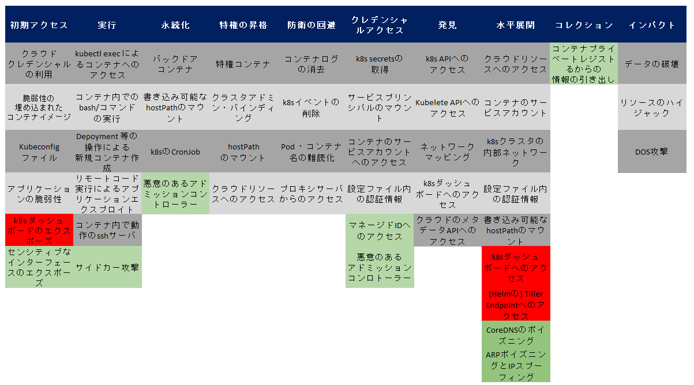

# はじめに

アプリケーションを動作させるための基盤として、Kubernetes はデファクトスタンダードな選択肢になりつつあります。しかしながら、高セキュリティ性を担保するための方法論は、技術コミュニティの中でもベストプラクティスを模索中の状況です。

このホワイトペーパーでは、このようなセキュリティ領域に焦点を当てた解説を行っていきます。

**1. 脅威モデル**  
インフラ基盤のセキュリティ対策に際しては、攻撃者の視点でセキュリティ攻撃の定石を理解することが重要です。
そのためには[脅威モデル(threat model)](https://en.wikipedia.org/wiki/Threat_model)という手法がしばしば用いられます。

脅威モデルとは、セキュリティ攻撃の実行者が用いる攻撃手段とリソース、攻撃の標的とする箇所などをまとめたセキュリティ攻撃のモデルです。
脅威モデルを利用することで、潜在的な脅威の把握やセキュリティ課題の棚卸と優先度付けなどの作業が容易になります。

**2. Threat Matrix for Kubernetes**  
[Threat Matrix for Kubernetes](https://www.microsoft.com/security/blog/2021/03/23/secure-containerized-environments-with-updated-threat-matrix-for-kubernetes/)は、Kubernetes に特化した脅威モデルです。
[Microsoft ブログにて 2020 年に発表](https://www.microsoft.com/security/blog/2020/04/02/attack-matrix-kubernetes/)され、その後 2021 年に改版されました。
このフレームワークを用いることで、Kubernetes 基盤に対し行われる可能性のあるセキュリティ攻撃を網羅的にチェックし課題を抽出できます。

Threat Matrix for Kubernetes は [MITRE ATT&CK](https://attack.mitre.org/) という脅威分析フレームワークがもとになっています。
[MITRE ATT&CK](https://attack.mitre.org/) は、サイバー攻撃の進展度合いを示すマトリクス形式の表を分析ツールとして用います。
マトリクスの横軸はサイバー攻撃のステージを表します。また縦軸は各攻撃ステージにおいて
攻撃者が利用する具体的な攻撃手法を表します。

以下に、Threat Matrix for Kubernetes を元に独自解釈を加えた表を示します。

本ホワイトペーパーでは、上記フレームワークから抽出する事のできるセキュリティ課題への対策に際し重要となる、いくつかの観点の解説を行います。
