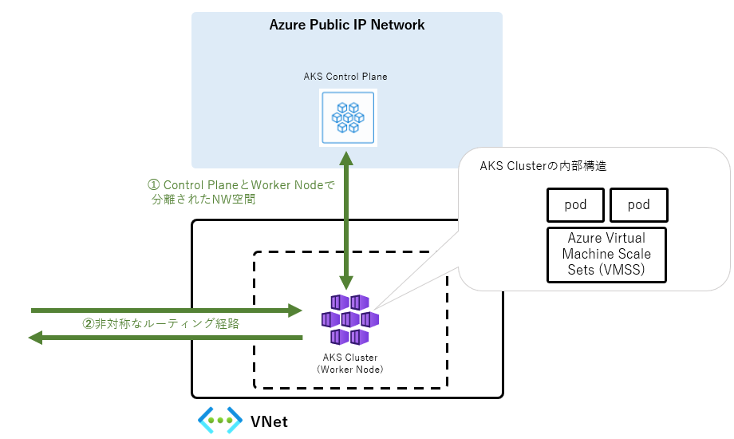
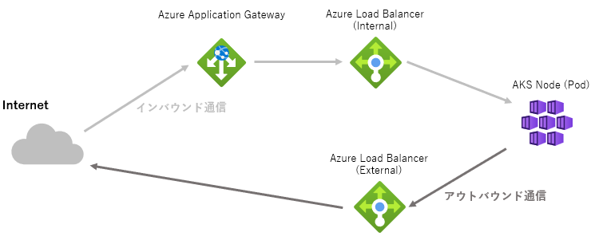
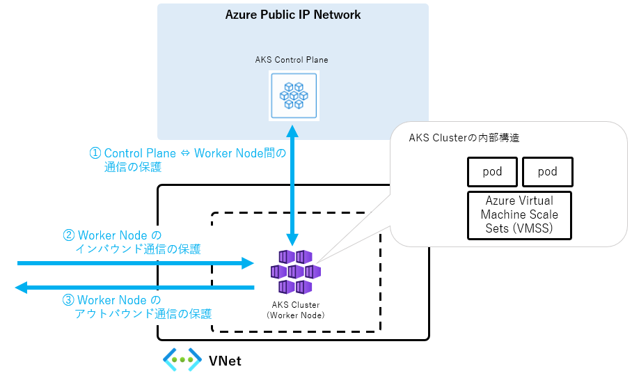
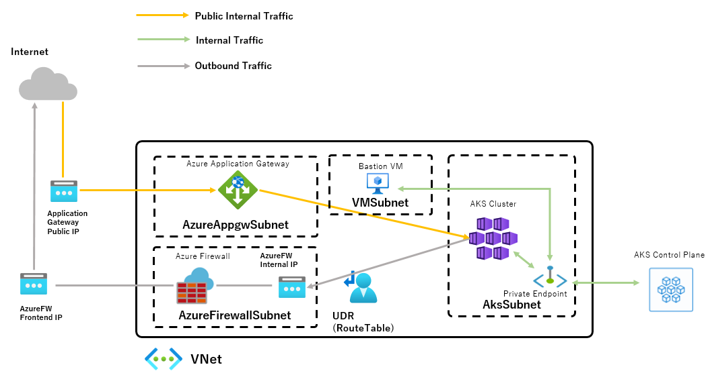

# **第1章 AKS ネットワーキングとセキュリティ**

## 本章の概要

セキュアな Kubernetes 基盤の設計を考える上では、ネットワークの観点でトラフィックやパケットを適切にコントロールし、[多層防御(Defense in Depth)](https://docs.microsoft.com/ja-jp/learn/modules/secure-network-connectivity-azure/2-what-is-defense-in-depth) の観点で悪意のある通信を遮断していくことが重要です。

そこで本章では Azure Kubernetes Service (以下、AKS) クラスターのネットワークセキュリティを解説します。
最初に AKS の内部ネットワークを理解するためのポイントを解説します。
次にセキュリティ強化の観点を概観し、最後に参照アーキテクチャを紹介します。

## 1. AKS のネットワークアーキテクチャの全体像

AKS のネットワークはオンプレミス環境の Kubernetes クラスターとは構成が大きく異なっています。そのためセキュリティ対策の検討に際しては理解が重要です。

本説では次の 2 つのポイントに絞って AKS の内部ネットワークを解説します。

1. Control Plane と Worker Node で分離されたネットワーク空間
2. 非対称なルーティング経路

### 1.1. Control Plane と Worker Node で分離されたネットワーク空間

Kubernetes では Control Plane と Worker Node は互いに独立したコンポーネントとして動作します。Control Plane は Kubernetes リソースのライフサイクルを管理し、Worker Node はコンテナー上のアプリケーションの実行を担います。また、Control Plane は Kubernetes リソースを操作するための API エンドポイントを持ち、Worker Node との通信もこの API エンドポイントを介して行われます。

Kubernetes クラスターのネットワーク構成はオンプレミス環境と Azure 環境では異なります。オンプレミス環境では Control Plane と Worker Node が同一のネットワーク空間に配置される構成が一般的です。対して **AKS では Control Plane と Worker Node が別個のネットワーク空間に所属しています。** そのため AKS のセキュリティをネットワークの観点で検討する際は、Control Plane と Worker Node のセキュリティ対策を別個に考える必要があります。

### 1.2. 非対称なルーティング経路

Worker Node は、インバウンド通信とアウトバウンド通信という 2 種の通信を実行します。インバウンド通信はインターネットから Aks Node に対して流入する通信を指し、Ingress 通信とも呼ばれます。またアウトバウンド通信は Aks Node からインターネットに対し送信される通信を指し、Egress 通信とも呼ばれます。AKS クラスターでは インバウンド通信とアウトバウンド通信でルーティングの経路が異なるため、それぞれの通信の保護を別個に考える必要があります。

具体的な通信の経路は AKS のネットワーク構成によって異なります。一例として、Azure CNI、Azure Load Balancer (Standard SKU)、Application Gateway Ingress Controller(AGIC) を使うパターンでは、以下のような経路でパケットがルーティングされる構成が一般的です。

- インバウンド通信 ： インターネット ⇒ Azure Application Gateway ⇒ Azure Load Balancer ⇒ AKS Node ( Pod )
- アウトバウンド通信 ： AKS Node ( Pod ) ⇒ Azure Load Balancer ⇒ インターネット

## 2. AKS クラスターのセキュリティ対策のポイント

次に AKS クラスターのセキュリティ対策のポイントをお話させて頂きます。

前節で解説の通り、AKS クラスターでは Control Plane と Worker Node でネットワーク空間が分離されています。また、インバウンド通信とアウトバウンド通信のルーティング経路が異なります。そのため、以下の 3 点をそれぞれ別個に検討をする必要があります。

1. Control Plane ⇔ Worker Node 間の通信の保護
2. インバウンド通信の保護
3. アウトバウンド通信の保護

### 2.1. Control Plane ⇔ Worker Node 間の通信の保護

Control Plane と Worker Node 間の通信の保護に際しては、
AKS Control Plane の API サーバーのエンドポイントへのアクセスの制限の検討が重要です。

AKS Control Plane のデフォルト構成では、API エンドポイントがインターネット空間に公開されています。
そのため、Kubernetes の脆弱性を利用した攻撃を受ける可能性があります。

このような攻撃を防ぐために、[Control Plane の API エンドポイントに対して接続する送信元 IP アドレスを制限する機能](https://docs.microsoft.com/ja-jp/azure/aks/api-server-authorized-ip-ranges)や、[Control Plane をプライベート IP 空間に限定公開する機能](https://docs.microsoft.com/ja-jp/azure/aks/private-clusters)が用意されています。 後者の機能を活用した具体的なネットワーク構成を次節で紹介します。

### 2.2. Worker Node のインバウンド通信の保護

AKS のインバウンド通信は初期設定ではすべての通信が許可されています。
そのため、SQL インジェクションなどのアプリケーションの攻撃を防ぐことができません。

これらの攻撃に備えるためには、Web アプリケーションの保護に特化した Web Application Firewall (WAF) サービスの活用が有効です。次節で Azure Application Gateway の WAF 機能を用いたセキュリティ保護の手法を紹介します。

### 2.3. Worker Node のアウトバウンド通信の保護

AKS のアウトバウンド通信は初期設定ではすべての通信が許可されています。
そのため、攻撃者が AKS 上の pod に侵入し外部の攻撃用のサーバーと通信することで、サイバー攻撃の被害がより拡大するリスクがあります。

これらの攻撃に備えるためには、アクセスリストを使ったレイヤー 4 レベルの通信の制御を検討する必要があります。次節で Azure Firewall を用いたセキュリティ保護の手法を紹介します。

## 3. 参照アーキテクチャ

### 3.1. 参照アーキテクチャの概要

前説までの内容を踏まえた、AKS の参照アーキテクチャを紹介します。

### 3.2. 前提条件

参照アーキテクチャにおける AKS クラスターのネットワーク構成は以下となります。

- Azure CNI
- Standard SKU Load Balancer
- Application Gateway Ingress Controller

※  いずれも AKS Subnet に属するリソースですが、図中では省略しています。

### 3.3.  Control Plane ⇔ Worker Node 間の通信の保護

参照アーキテクチャでは、**2.1. Control Plane ⇔  Worker Node 間の通信** で紹介の AKS の[プライベートクラスター機能](https://docs.microsoft.com/ja-jp/azure/aks/private-clusters)を用いることで、通信の保護を行っています。

すでに解説の通り AKS クラスターのネットワークはデフォルトでは、API サーバーのエンドポイントがインターネット空間に公開されます。このようなセキュリティ強度の低い状態は AKS のプライベートクラスター機能で解消できます。AKS クラスターのプライベートクラスター機能を有効化するとインターネット空間からエンドポイントへのアクセスが不可となり、代わりに VNET 空間よりアクセスするためのプライベートエンドポイントが作成されます。これによりセキュアな Control Plane ⇔ Worker Node 間通信が実現できます。

### 3.4. Worker Node のインバウンド通信の保護

**3.1. 参照アーキテクチャの概要** で掲載の図中で `Public Internal Traffic` と記載されている通信がインバウンド通信です。
参照アーキテクチャでは、[Azure Application Gateway](https://docs.microsoft.com/ja-jp/azure/application-gateway/overview) 上の [Web Application Firewall (WAF)](https://docs.microsoft.com/ja-jp/azure/web-application-firewall/ag/ag-overview) 機能を用いインバウンド通信の保護を行っています。

Azure Application Gateway は HTTP(S) 通信に特化したロードバランサーです。
レイヤー 7 レベルのルーティング、SSL 通信の暗号化と複合化などの機能を提供します。

Azure Application Gateway が持つ WAF 機能を利用することで流入する通信を保護できます。
インターネットより流入するパケットは国際的なサーバーセキュリティ攻撃のデータベースである、[OWASP (Open Web Application Security Project) のコアルールセットに基づき検査され](https://docs.microsoft.com/ja-jp/azure/web-application-firewall/ag/application-gateway-crs-rulegroups-rules?tabs=owasp32)、悪意のある通信とみなされるパケットは破棄されます。

### 3.5. Worker Node のアウトバウンド通信の保護

**3.1. 参照アーキテクチャの概要** で掲載の図中で `Outbound Traffic` と記載されている通信が AKS のアウトバウンド通信です。参照アーキテクチャでは、[Azure Firewall](https://docs.microsoft.com/ja-jp/azure/firewall/overview) によってアウトバウンド通信の保護を行っています。

Azure Firewall は[ネットワークアドレス変換(NAT)](https://docs.microsoft.com/ja-jp/azure/virtual-network/nat-gateway/nat-overview) を提供するファイヤーウォールサービスです。
参照構成では AKS Node (Pod) より外部に送出されるパケットに対し、レイヤー 3 / 4 / 7 レベルのパケットフィルタリングを適用します。

また、Azure Firewall はクラウドネイティブなマネージドサービスの特性を活かした高い可用性とスケーラビリティを持ちます。そのため AKS クラスター上のワークロードのスケールに対し柔軟に追随することが可能です。

### 3.6. 参照アーキテクチャのデプロイ方法

参照アーキテクチャをデプロイする方法につきましては、[こちらのページ](https://github.com/ap-communications/msj-security-whitepaper/codes/README.md) を参照ください。

---

## コラム：制御ループとコントローラー

Kubernetes リソースの状態は[制御ループ](https://kubernetes.io/ja/docs/concepts/architecture/controller/)と呼ばれる機能によって管理されます。
制御ループは Kubernetes Manifest ファイルによって定義された状態を「**あるべき状態(Desired State)**」と位置づけ、実際のリソースの状態が「あるべき状態」と合致しているかどうかを常時監視します。このような制御ループ機能を提供するミドルウェアのことを ***コントローラー(Controller)*** と呼びます。

実際のリソースの状態と「あるべき状態」との間に差分が生じた場合、コントローラーは実リソースの状態が「あるべき状態」と合致するよう
実リソースの上書きを行います。そのため、**リソースの状態を変更する際は、実際のリソースではなくリソースを定義の Kubernetes Manifest ファイルを修正する必要があります。** 実リソースの構成情報のみを手動で変更しても、コントローラーがその変更を「差分」と検知し、ロールバックしてしまうためです。

AKS で  `kind: Ingress`  リソースを利用の際は、Ingress リソース専用のコントローラーである Ingress Controller のデプロイが必要です。詳細は以下のページを参照ください。

[Azure Kubernetes Service (AKS) でイングレス コントローラーを作成する](https://docs.microsoft.com/ja-jp/azure/aks/ingress-basic)

---

## コラム：AKS での Ingress Controller の選定

AKS クラスター上での Web アプリケーションの公開に際しては、HTTP ルーティングやドメイン管理など、レイヤー 7 レベルのネットワークの制御・構成管理が必要です。これらの機能を実現するために、Kubernetes では `kind: Ingress` という HTTP ゲートウェイを管理するためのリソースが用意されています。

 `kind: Ingress` を利用するためには、 Ingress Controller と呼ばれるコントローラーをデプロイする必要があります。Azure では複数の Ingress Controller が用意されており、用途に合わせて選ぶことができます。本書の執筆時点では [Application Gateway Ingress Controller](https://docs.microsoft.com/ja-jp/azure/application-gateway/ingress-controller-overview) (以下、 AGIC) と [NGINX Ingress Controller](https://github.com/kubernetes/ingress-nginx) の 2 つが主要な選択肢です。

AGIC と NGINX Ingress Controller の使いわけの観点ですが、大きく 2 点に分けられます。

1 つ目の観点は、ゲートウェイがデプロイされる場所です。AGIC では、Azure Application Gateway のインスタンスが AKS クラスター外にデプロイされます。そのために管理者はゲートウェイが動作するために必要となる CPU などのサーバリソースの心配する必要がありません。それに対して、NGINX Ingress Controller では AKS 上の pod としてゲートウェイがデプロイされるため、ゲートウェイが動作するために必要なサーバリソースを考慮にいれて、Worker Node のサイジングを行う必要があります。

2 つ目の観点は、機能の差です。AGIC と NGINX Ingress Controller のいずれも、基本的なパスベースの HTTP ルーティングの機能は有します。しかし、提供される機能の詳細なカバー範囲は異なります。複雑な HTTP ルーティングを実装したいなど、機能要件によってはいずれかの Ingress Controller が選択肢から外れることもありえます。そのため Ingress Controller の選定に際し、必要となる機能を洗い出しておくことが重要です。
