# 第2章 セキュリティイベントのモニタリング

## 1. 本章の概要

第 1 章では、ネットワーク領域にスコープを絞り **Azure Kubernetes Service** (以下 AKS) のセキュリティ対策を解説しました。Cloud Native 以前の一般的なシステムでは、このようなネットワークレベルの境界型の通信の管理のみでセキュリティが担保できていました。しかしながら、サイバー攻撃の高度化に伴い、すべての攻撃をネットワークのみで遮断する想定は現実的ではなくなりつつあります。

そこで本章ではネットワークのレイヤ以外で対応が必要な脅威 / リスクを概観し、対策について考えていきます。

## 2. ネットワークレイヤ以外で対策な必要な観点

具体的に検討が必要な脅威を解説していきます。

- Kubernetes API の悪用
- 脆弱性を狙った攻撃
- 攻撃者による侵入に気づけないリスク

### 2.1. Kubernetes API の悪用

攻撃者は Kubernetes API を使って、Worker Node や Pod レベルの攻撃のための足掛かりとなるリソースのデプロイを試みます。
そのため、このような攻撃を防ぐ措置が必要です。

※ [第1章で解説の AKS クラスターのプライベート化、API エンドポイントのグローバル IP 制限](https://github.com/ap-communications/msj-security-whitepaper/blob/main/chapter01.md#33--control-plane--worker-node-%E9%96%93%E3%81%AE%E9%80%9A%E4%BF%A1%E3%81%AE%E4%BF%9D%E8%AD%B7) を行うことでリスクを低減することは可能ですが、それで全ての攻撃を防ぐことができる訳ではありません。そのため多層防御の観点でネットワーク以外のレイヤでも防御策を講じることが望ましいです。

### 2.2. 脆弱性を標的とした攻撃

AKS クラスターおよびその内部で動作の Pod が適正に設定されていない場合、攻撃者の攻撃の起点として利用される可能性があります。例えば Pod の内部で sshd サーバを起動させたことによって、攻撃者による ssh 通信経由でのアクセスを許してしまう例がこのケースに該当します。

このような攻撃を防ぐためには、脆弱性の原因となりえるような不適切な設定をスキャンし、
セキュリティホールを塞いでいく対応が必要です。

### 2.3. 攻撃者による侵入に気づけないリスク

攻撃者による AKS Worker Node / Pod への侵入を許してしまった場合、迅速な検知が重要です。
侵入に気づけず長時間の攻撃者の滞在を許してしまうと、セキュリティインシデントの被害が増大するリスクがあります。

### 2.4. 脅威の防止のために防護すべき箇所の整理

このような脅威が発生する箇所を下図に整理しました。

Kubernetes API の悪用は、Control Plane の API サーバーを標的として行われます。
また、脆弱性を標的とした攻撃では、攻撃者はしばしば AKS Node または Pod へのログインを短期的な攻撃のゴールとします。
そのため、攻撃者による侵入に気づけないリスクも、AKS Node および Pod が保護対象です。

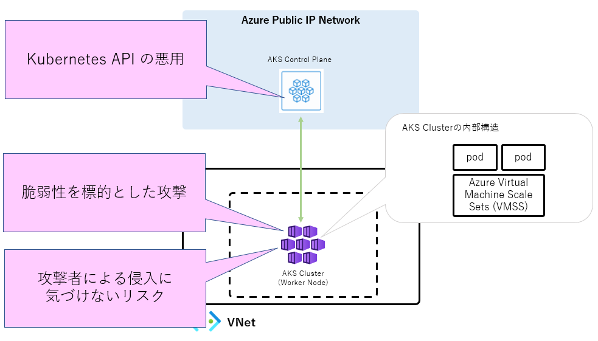

### 2.5. 運用体制と想定ユースケース

前述の脅威を適切にハンドリングするため、運用者によるセキュリティイベントの検出と是正処置の実施が必要です。AKS クラスターの運用体制例を基に、セキュリティの観点であるべき運用フローを考えてみましょう。

まず例とする運用体制ですが、Kubernetes クラスターの運用では Kubernetes クラスターの管理者とアプリケーション開発者が共同して業務を進める体制が推奨されます。下図のようにクラスター管理者が AKS Control Plane と Worker Node の構成管理を行い、アプリケーション開発者はアプリケーションの開発および Pod の構成情報の管理の責務を負います。

※ 従来型のオンプレミス環境の大規模システムでは、専業のインフラチームが全てのインフラシステムを管理する体制が一般的でした。セキュリティについても境界型のネットワークをベースにゲートウェイや Firewall のみで担保されるケースが多く見られました。しかしながら、Cloud Native なアプリケーションではアプリケーションや Pod レベルのセキュリティ対策(脆弱性管理、構成管理)も必要です。また、このような対策は開発チームで担当することが推奨されています。

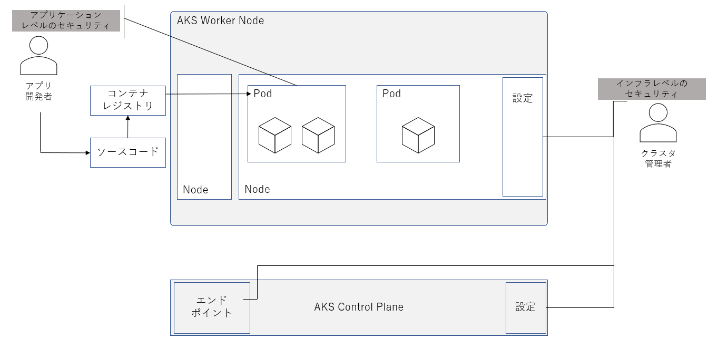

さらに、前述の 3 つの脅威を追記した図が以下です。運用設計の観点で重要な示唆が 2 点あります。

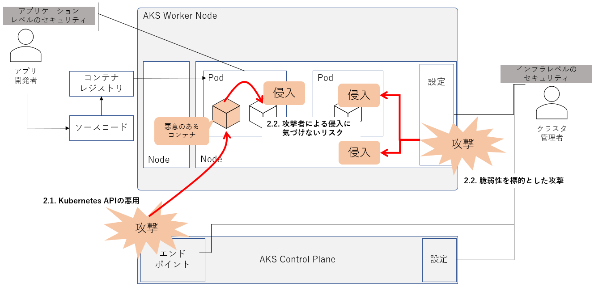

第一に、攻撃者が Kubernetes API を悪用し、セキュリティ攻撃用の Pod をデプロイし、他の Pod / コンテナーへの侵入を試みる攻撃パターンが存在します。これは **2.1. Kubernetes API の悪用** で解説のパターンに該当します。この際 Pod への侵入は早急に対処するために、アプリケーション開発者に対し迅速にフィードバックされる必要があります。また、悪意のあるコンテナーのデプロイについても、クラスター管理者・アプリケーション開発者の双方に通知される必要があります。クラスター管理者は Kubernetes API の保護のために Control Plane の設定を見直す必要があり、アプリケーション開発者は攻撃の状況を把握し、必要な対処を迅速に実施する必要があります。

第二に、AKS Worker Node の設定の不備が原因で、Worker Node や Pod への攻撃者の侵入を許してしまう攻撃パターンが存在します。このパターンは **2.2. 脆弱性を標的とした攻撃** 、 **2.3. 攻撃者による侵入に気づけないリスク** のパターンに該当します。この際 Worker Node への侵入は早急に対処する必要があるため、クラスター管理者にフィードバックされる必要があります。同様に侵入の原因となりえる設定の不備についても、クラスター管理者に通知・処置される必要があります。

上記を踏まえたセキュリティ検知(通知)フローの全体像は以下となります。

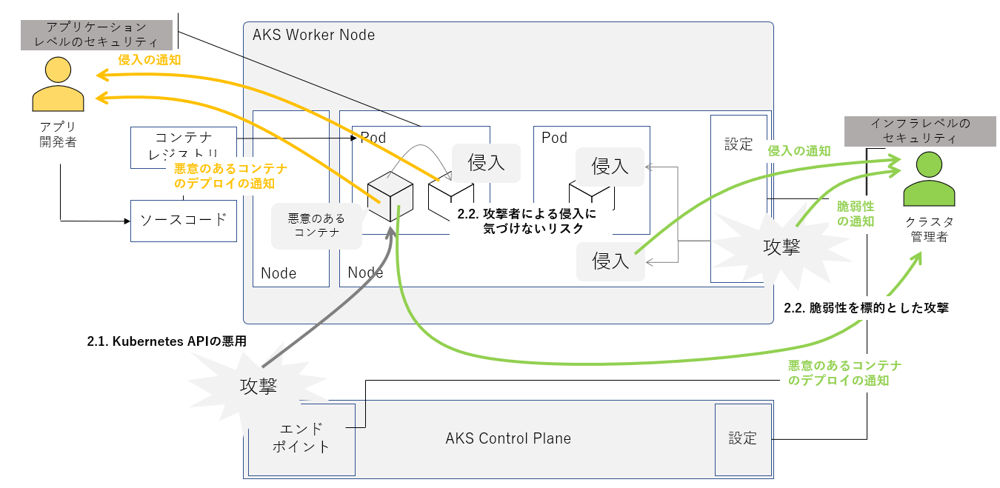

## 3. 参照アーキテクチャー

前節で解説の脅威 / リスクの対策方法を解説します。参照アーキテクチャを紹介した後、以下の順に話を進めます。

- Kubernetes 用の Policy アドオンによる Kubernetes API 悪用の防止
- 「推奨事項」機能による脆弱性の排除
- アラーティングによる侵入の検知

**参照アーキテクチャの構成**  
本章で紹介の参照アーキテクチャは  [Microsoft Defender for Cloud](https://docs.microsoft.com/ja-jp/azure/defender-for-cloud/defender-for-cloud-introduction) および [Microsoft Defender for Containers](https://docs.microsoft.com/ja-jp/azure/defender-for-cloud/defender-for-containers-introduction?tabs=defender-for-container-arch-aks) を活用した構成となっています。Microsoft Defender for Cloud (以下 Defender for Cloud) は Azure 上のクラウドリソースの統合的なセキュリティ保護を目的としたサービスです。 Microsoft Defender for Containers (以下 Defender for Containers) は AKS の保護に特化した Defender for Cloud の拡張機能です。

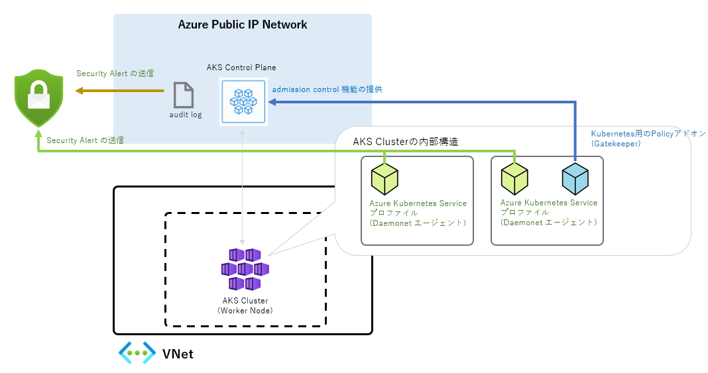

### 3.1. Kubernetes 用の Policy アドオンによる Kubernetes API 悪用の防止

Defender for Containers では、 `Kubernetes 用の Policy アドオン` という名称の [Admission Control](https://kubernetes.io/docs/reference/access-authn-authz/admission-controllers/) 機能が提供されています。
Admission Control は Kubernetes リソースの操作に対し、追加の検証処理を追加する機能です。
様々な目的での利用が可能ですが、ここではソースの操作がセキュリティポリシーに適合するかどうかの検証に使われます。

`Kubernetes 用の Policy アドオン` を有効化することで、 [Gatekeeper](https://kubernetes.io/blog/2019/08/06/opa-gatekeeper-policy-and-governance-for-kubernetes/) v3 がデプロイされます。
Gatekeeper は [admission controller webhooks](https://kubernetes.io/docs/reference/access-authn-authz/extensible-admission-controllers/) 機能を提供する Web サーバとして動作し、
Kubernetes リソースの操作リクエストに対し [Azure Policy](https://docs.microsoft.com/ja-jp/azure/governance/policy/overview) を使った検証を実施します。
検証の結果は Azure Policy サービスに通知されます。

この一連に処理によって、サイバー攻撃の起点となりえる Kubernetes リソースの操作が制限されます。
一例として、[特権コンテナーのデプロイが禁止されます](https://portal.azure.com/#blade/Microsoft_Azure_Policy/PolicyDetailBlade/definitionId/%2Fproviders%2FMicrosoft.Authorization%2FpolicyDefinitions%2F95edb821-ddaf-4404-9732-666045e056b4)。適用されるセキュリティポリシーの詳細は[こちら](https://docs.microsoft.com/ja-jp/azure/aks/policy-reference)をご覧ください。

### 3.2. 「推奨事項」機能による脆弱性の排除

Defender for Cloud を活用することで Worker Node および Pod の構成情報をスキャンし、サイバー攻撃につながる不具合や構成情報の設定不備の有無を監視できます。監視の結果は Defender for Cloud の管理画面(`推奨事項`) より確認できます。

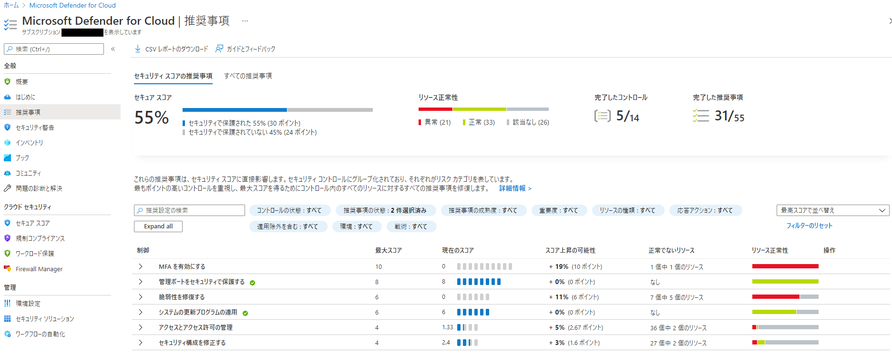

Defender for Cloud は Worker Node および Pod の構成情報を精査し、予め定められたルールに適合しないリソースを発見すると、セキュリティ強化のための改善提案を生成します。このルールのことを **Security Policy** 、改善提案のことを **推奨事項** と呼びます。

推奨事項の具体例を以下に掲載します。

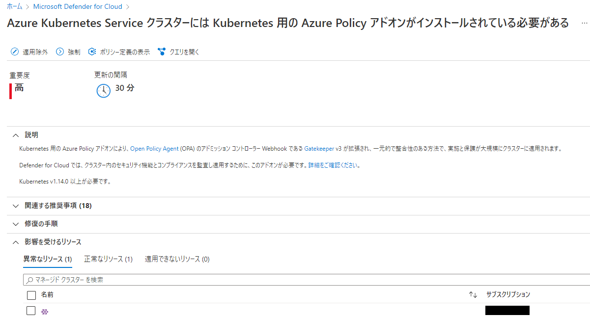

また、ルールの遵守状況は[セキュリティスコア](https://docs.microsoft.com/ja-jp/azure/defender-for-cloud/secure-score-security-controls)の値でメトリクス化されます。

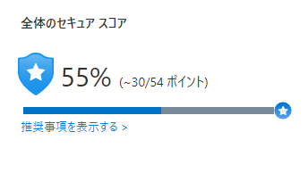

セキュリティスコアの値を KPI として、セキュリティの強化のための PDCA プロセスを何度も回すことで、セキュリティ体制を改善し続けることが可能です。

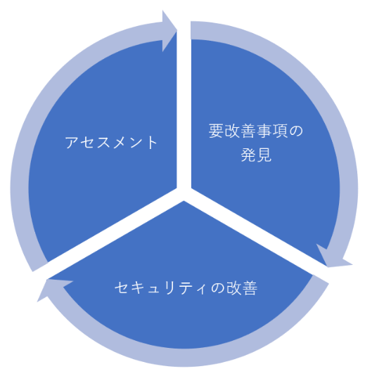

### 3.3. アラーティングによる侵入の検知

#### 3.3.1. audit log スキャンによる Control Plane レベルのアラーティング

Defender for Containers を有効化することで、 AKS クラスターの audit log のスキャンが有効化されます。
これによって、セキュリティ攻撃の疑いのある Kubernetes API の操作が実行された際にセキュリティ脅威の通知が行われます。
セキュリティ脅威は **セキュリティアラート** または **セキュリティインシデント** として通知されます。

セキュリティアラートは個別のリソースに対して検知された脅威を表します。複数のセキュリティアラートに関連性が認められる場合には、セキュリティインシデントが追加で生成されます。 セキュリティインシデントを利用することで、複数の検知された脅威情報を元にした総合的な脅威分析が可能です。

セキュリティアラート / インシデントは、Defender for Cloud の `セキュリティ警告` 画面より参照できます。
また 3 段階の重要度によって分類され、 MITRE フレームワークの戦術(Tactics)と関連付けられます。

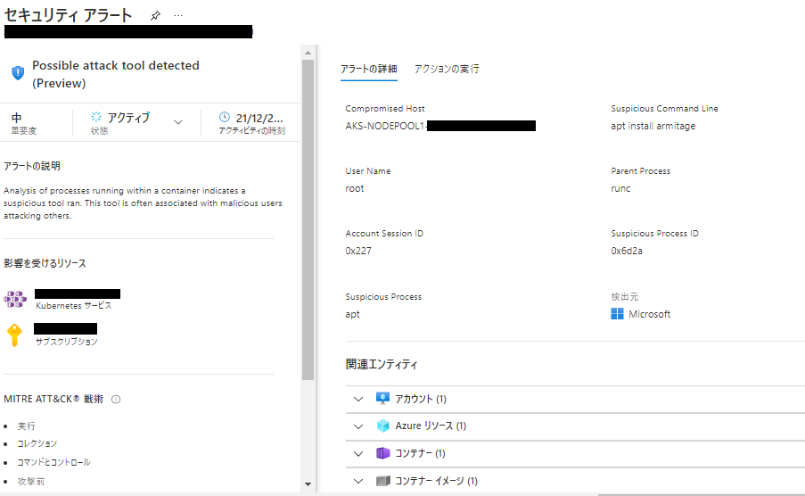

#### 3.3.2 Azure Kubernetes Service プロファイル による Worker Node のレベルのアラーティング

Defender for Containers の「Azure Kubernetes Service プロファイル」機能を利用することで、
Worker Node / Pod 上でのセキュリティ攻撃の疑いがある操作の検知が可能です。

`Azure Kubernetes Service プロファイル` 機能を有効化すると監視エージェントが DaemonSet リソースとして動作する AKS Node にデプロイされます。この監視エージェントは、デプロイ先となる Worker Node と Pod を監視し、セキュリティ攻撃の疑いのある痕跡を発見すると、セキュリティ脅威の通知を送信します。セキュリティ脅威は audit log 監視と同様に、セキュリティアラートまたはセキュリティインシデントとして通知され、Defender for Cloud の `セキュリティ警告` 画面より確認が可能です。

## 4. チュートリアル

本節では、**3.3. アラーティングによる侵入の検知** で紹介のアラート機能を、ハンズオン形式で説明をさせていただきます。

一連の手順は Web ブラウザ上にて **Microsoft Azure Portal** (以下 Portal) にアクセスして実施します。次項に進む前に、Portal へサインイン可能なアカウントを予めご準備ください。

**チュートリアルの概要**
本チュートリアルの概要は以下となります。

- チュートリアル環境共用のリソースグループを作成  
- Defender for Containers の連携対象として AKS クラスターをプロビジョニング  
  ※操作の簡便化のために、今回はパブリッククラスター構成とします  
- Defender for Containers プランの有効化  
    ※ Defender for Cloud の連携対象はご契約のサブスクリプション全体に及びます。[ご注意ください](https://docs.microsoft.com/ja-jp/azure/defender-for-cloud/enhanced-security-features-overview#how-do-i-enable-defender-for-clouds-enhanced-security-for-my-subscription)。  

**課金のご注意**  
チュートリアルの実施に際し、Defender for Containners や AKS クラスターをご利用の際に課金が発生いたします。  本チュートリアル完了後に課金の継続を希望されない場合は、 **4.6. リソースのクリンナップ** 項でリソースのクリンナップを実施してください。  

※ 課金参考: [Defender for Cloud の価格オプション](https://azure.microsoft.com/ja-jp/pricing/details/defender-for-cloud/)  

**チュートリアル環境の構成**  
本チュートリアルにおける AKS クラスターと Defender for Containers の構成は以下となります。

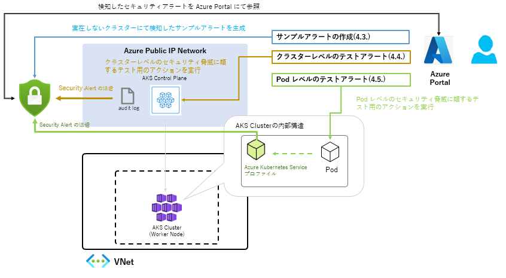

  今回は、Defender for Containers でどのようなアラートを検知できるか体験していただくために、サンプルアラートの作成や AKS クラスター上で疑似的な脅威イベント発生させてテストアラートの検知を行います。

### 4.1. AKS クラスターのプロビジョニング

#### 4.1.1. Azure Cloud Shell 起動  

Portal 上にてコマンドラインで Azure リソースの操作・管理が可能な **Azure Cloud Shell** (以下 Cloud Shell) を起動します。  

画面上部の右側のターミナルのアイコンをクリックしてください。
画面下部に CUI 環境が展開されます。

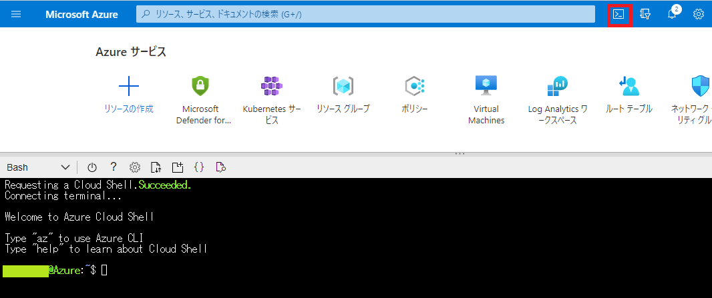

#### 4.1.2. アカウント / サブスクリプション選択  

Cloud Shell にてご利用になるアカウントが間違いないか確認してください。  
`Name` 列に表記されているサブスクリプション名が、ご希望のサブスクリプションであるかを確認してください。  

```bash
$ az account show -o table
EnvironmentName    HomeTenantId   IsDefault  Name           State    TenantId
-----------------  -------------  ---------  -------------- -------  -------------
AzureCloud         <UUID>          True      <Subscription>  Enabled  <UUID>
```

#### 4.1.3. リソースグループ作成  

Cloud Shell にてリソースグループの作成とリージョン環境を指定します。
まずは作成するリソースの名称を定義します。以下の環境変数に、任意の名称を定義してください。  

```bash
RESOURCE_GROUP='<リソースグループ名>'
LOCATION='<リージョン名>'
AKS_CLUSTER='<AKS クラスター名>'
```

ご利用のアカウントで選択可能なリージョンを確認したい場合は、以下のコマンドでリージョン一覧を取得できます。`Name` 列に表記されている名称が、`az` コマンドで入力するリージョン名です。

```bash
$ az account list-locations -o table
DisplayName               Name                  RegionalDisplayName
------------------------  -------------------  -------------------------------------
East US                   eastus               (US) East US
East US 2                 eastus2              (US) East US 2
South Central US          southcentralus       (US) South Central US
West US 2                 westus2              (US) West US 2
West US 3                 westus3              (US) West US 3
Australia East            australiaeast        (Asia Pacific) Australia East
Southeast Asia            southeastasia        (Asia Pacific) Southeast Asia
North Europe              northeurope          (Europe) North Europe
Sweden Central            swedencentral        (Europe) Sweden Central
UK South                  uksouth              (Europe) UK South
West Europe               westeurope           (Europe) West Europe
Central US                centralus            (US) Central US
North Central US          northcentralus       (US) North Central US
West US                   westus               (US) West US
South Africa North        southafricanorth     (Africa) South Africa North
Central India             centralindia         (Asia Pacific) Central India
East Asia                 eastasia             (Asia Pacific) East Asia
Japan East                japaneast            (Asia Pacific) Japan East
```

リソースグループの作成を実行します。

```bash
$ az group \
  --name ${RESOURCE_GROUP} \
  --location ${LOCATION}
```

リソースグループが正常に作成されていることを確認します。  
出力されたリソースグループの一覧に作成したリソースグループ名が存在することを確認してください。  

```bash
$ az group list -o table
```

#### 4.1.4. AKS クラスター構築  

AKS クラスターの作成を実行します。

```bash
$ az aks create \
  -n ${AKS_CLUSTER} \
  -g ${RESOURCE_GROUP} \
  --network-plugin azure \
  --network-policy azure \
  --enable-addons azure-policy \
  --generate-ssh-keys \
  --enable-node-public-ip
```

クラスターが正常に作成されていることを確認します。  
本節では詳しく触れませんが Kubernetes 用の Policy アドオンの有効化は、`--enable-addons azure-policy` のオプションで指定します。  
出力された AKS クラスターの一覧に作成したクラスター名が存在することを確認してください。  

```bash
$ az aks list -o table
```

#### 4.1.5. AKS クラスタークレデンシャル取得  

AKS クラスター内の Kubernetes リソースを操作する際には `kubectl` コマンドを利用します。  

Cloud Shell 環境では、予め `kubectl` がインストールされています。  
構築した AKS クラスターへアクセスするために認証情報を含めたクラスターの構成情報を `az` コマンドで取得します。  

```bash
$ az aks get-credentials \
  -n ${AKS_CLUSTER} \
  -g ${RESOURCE_GROUP}

A different object named <AKS クラスター名> already exists in your kubeconfig file.
Overwrite? (y/n):
```

※過去に同名のクラスターを作成している場合は、上書きの確認メッセージが表示されます。

### 4.2. Microsoft Defender for Containers の有効化(GUI操作)

#### 4.2.1. Defender for Containes 有効化  

Portal 画面上部の検索ボックスにて `defender` と入力し、  
検索候補として表示される `Microsoft Defender for Cloud` をクリックしてください。  
Defender for Cloud のサービス画面へ遷移します。

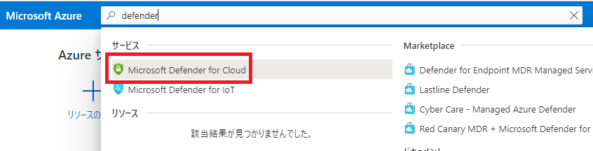

有効化を反映する対象サブスクリプションを選択します。  
画面左部メニューより、`管理` -> `環境設定` を選択してください。
画面右部にテナント / アカウント / サブスクリプションのツリーが表示されます。
ツリーをドリルダウンで展開してチュートリアルで利用する `サブスクリプション` (鍵マーク)を選択してください。

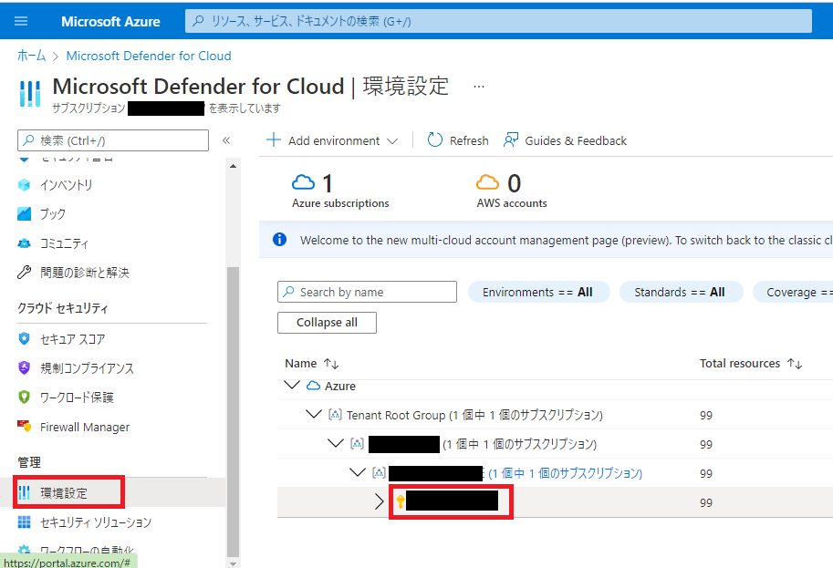

`設定|Defender プラン` の画面が表示されます。  
画面右部を下へスクロールすると、`Defender プラン` の一覧が表示されます。  
プラン一覧より `コンテナー` のスライドボタンを `オフ` から `オン` に変更してください。  
変更後は、`保存` ボタンをクリックしてください。

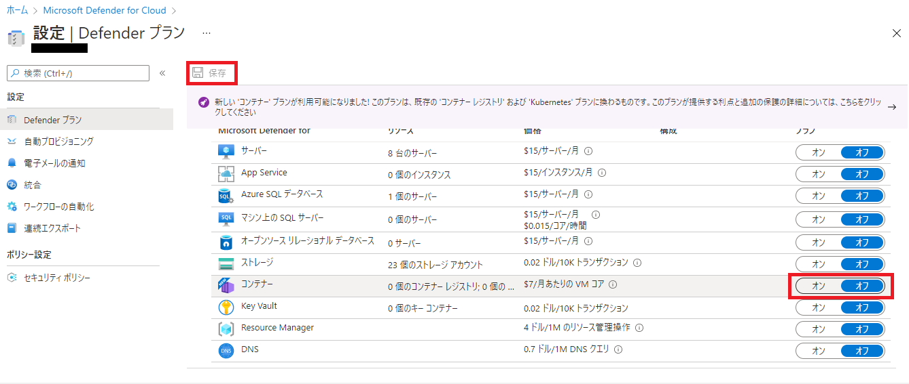

Portal 画面右上にて、対象サブスクリプションの `Defender プラン` (コンテナー)が正常に更新されたとのメッセージが確認できましたら有効化は完了です。

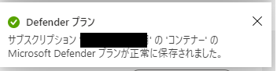

チュートリアル実施前から Defender for Containers を有効化されている場合は Defender プランをアップグレードする必要がある場合があります。  
Defender for Cloud サービス画面にて以下のようにアップグレードを推奨するメッセージが表示されている場合は、アップグレードを実施してから次へ進んでください。

※ 推奨メッセージが表示されていない場合は、アップグレード対応は不要です。  

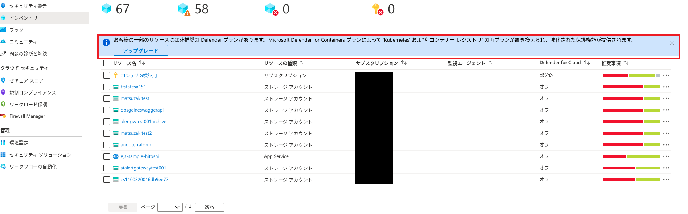

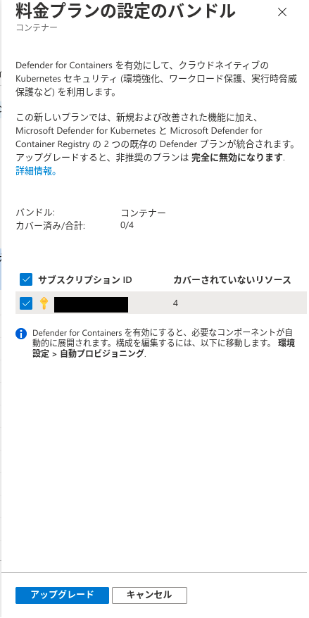  

#### 4.2.2. Defender プロファイルを有効化(Fix)  

この時点ではまだ AKS クラスターと Defender for Containers 間で連携する環境が完成しておりません。  
Defender for Containers と連携するために `Defender プロファイル` を AKS クラスターへデプロイします。  

Portal 画面より Defender for cloud サービスに遷移して、画面左部メニューより `インベントリ` をクリックしてください。  
Defender for Cloud にて管理されているリソースの一覧が表示されます。  
画面上部のフィルターボックスにて、AKS クラスター名を入力して表示するリソースを制限してください。  
一覧より AKS クラスター名を確認できましたら、クリックしてください。  

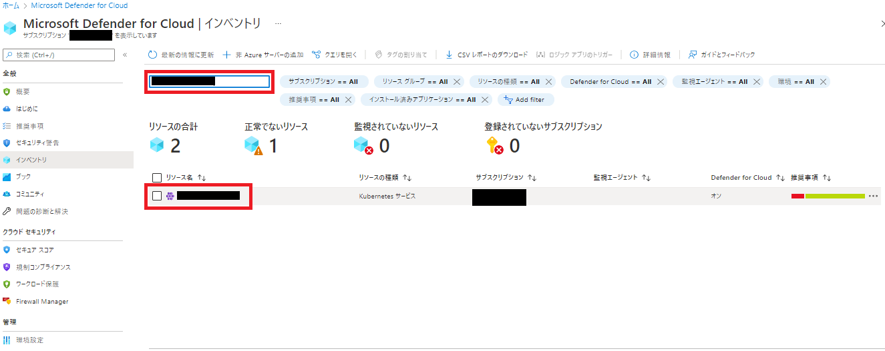

選択した AKS クラスターの、セキュリティ正常性の評価結果が一覧で表示されます。  
一覧より `Azure Kubernetes Service クラスターで Defender プロファイルを有効にする必要がある` をクリックしてください。  

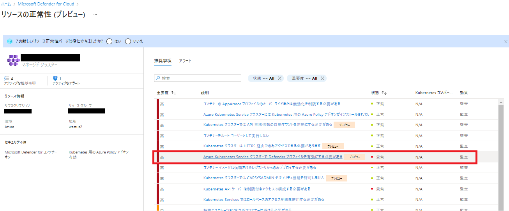

本項目で `Defender プロファイル` がまだ有効されていないことが確認できます。  
`Defender プロファイル` を有効化するために画面左下の `Fix` ボタンをクリックしてください。  

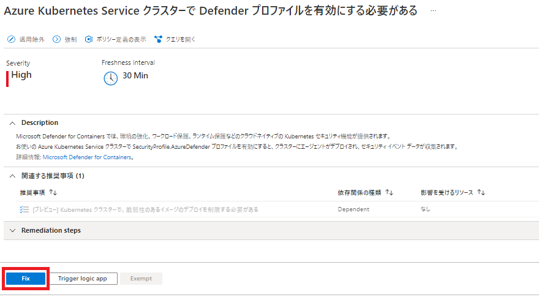

対象リソースに誤りがなければ、画面右下部の `1個のリソースを修正` をクリックしてください。

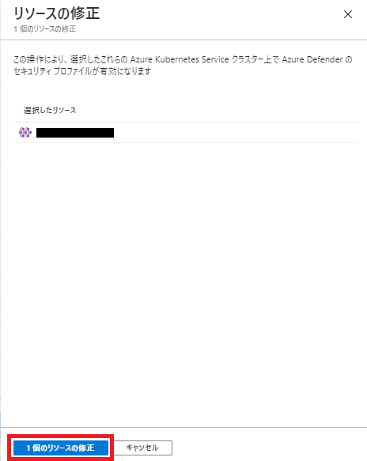

画面右上に `Fix` が実行中であることを示すメッセージが表示されます。  
完了までお待ちください。  

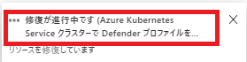

`Fix` が正常に完了していることを確認する場合は、画面右上部をベルメークをクリックして、以下のメッセージがあることを確認してください。  

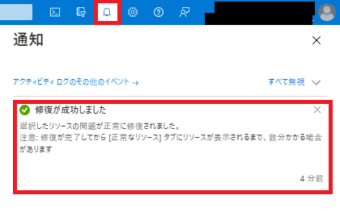

### 4.3. サンプルアラートの作成

### 4.3.1. Portal にてサンプルアラートの作成  

チュートリアル環境の下準備は一通り整いました。  
続きまして、Defender for Containters でどのようなアラートを検知することができるかを見ていただきます。  

Defender for Cloud のサービス画面の左側メニュ一覧より `セキュリティ警告` をクリックしてください。  

※ 参考情報:
- [セキュリティ アラートの管理](https://docs.microsoft.com/ja-jp/azure/defender-for-cloud/managing-and-responding-alerts#manage-your-security-alerts)
- [Defender for Containers のアラート一覧](https://docs.microsoft.com/en-us/azure/defender-for-cloud/alerts-reference#alerts-k8scluster)  

画面右側にアラートの一覧が表示されます。  
まずはサンプルのアラートの例を紹介いたします。  
`サンプルのアラート` をクリックしてください。  

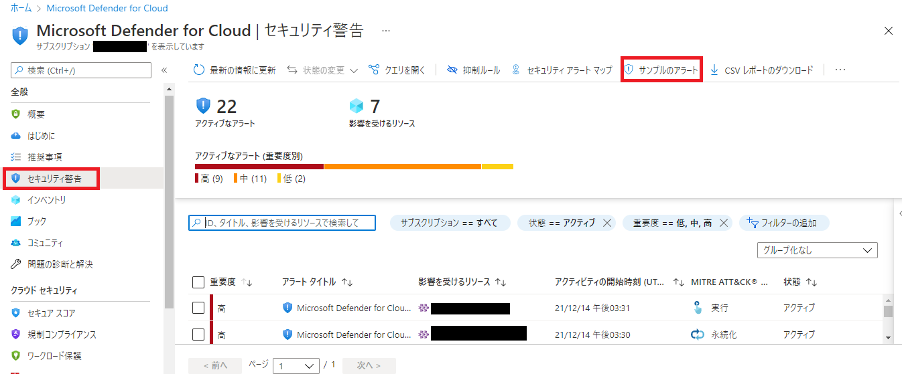

画面右側で作成するサンプルアラートの発報先となるサブスクリプションとプランを選択します。  

ご利用予定の任意のサブスクリプションを選択して、`Defender for Cloud プラン` でサンプルアラートを発報するプランを指定します。  
今回は、`Kubernetes サービス` のみをチェックボックスを選択します。  
`サンプルアラートの作成` ボタンをクリックして、アラートを発報します。  

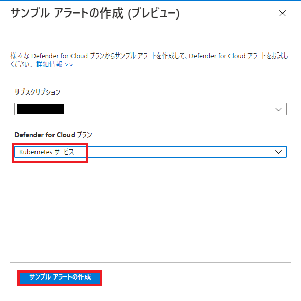

### 4.3.2. サンプルアラートの確認  

しばらくすると `セキュリティ警告` のアラート一覧にてサンプルアラートが検知されます。  

`アラートタイトル` 列にて `サンプル アラート` の文言が含まれているものがサンプルアラートです。  

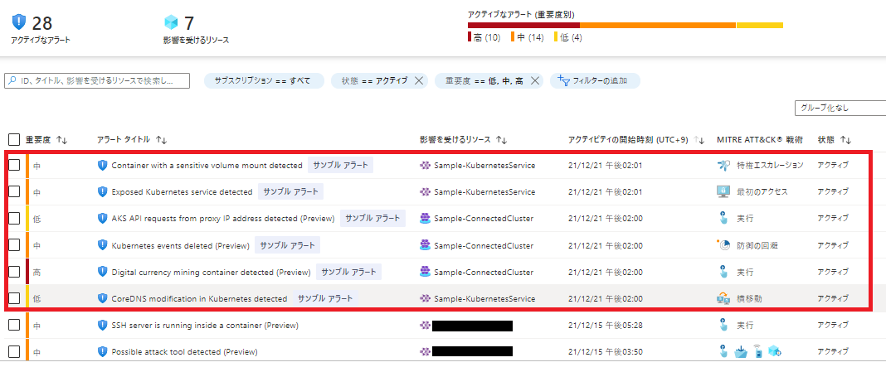

発報されたサンプルアラートの詳細なアラート情報を確認してみます。  
アラートの一覧より適当な一件のアラートをクリックしてください。  
画面右側にて、対象アラートに関する詳細が表示されます。  
更に詳しい情報を確認するために、`すべて詳細を表示` ボタンをクリックしてください。  

※ 参考情報: [セキュリティの警告への対応](https://docs.microsoft.com/ja-jp/azure/defender-for-cloud/managing-and-responding-alerts#respond-to-security-alerts)

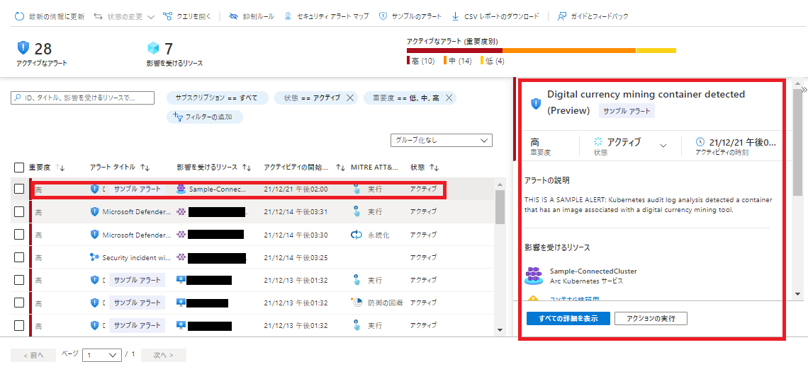

詳細情報を参照すると、アラートの事象や該当する Azure リソースのコンポーネント加えて、具体的にどのプロセスやファイルでアラートが発生したかを確認できます。

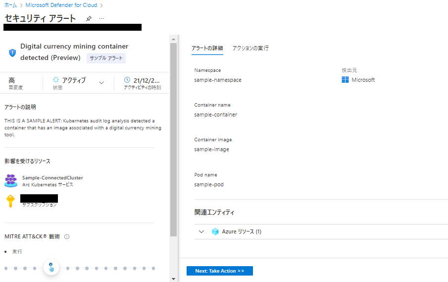

また、`アクションの実行` タブをクリックすると、該当のアラートに対して対応するべきアクションを参照できます。  

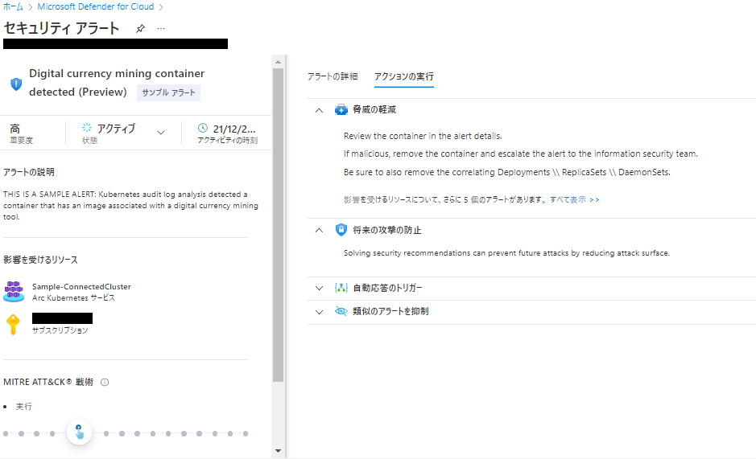

### 4.4. AKS クラスターレベルのテストアラートの検知

### 4.4.1. Cloud Shell にて kubectl 実行  

アラートのサンプルをご覧いただきまして次は、AKS クラスターにて特定のアクションを実行してテストアラートを発報させます。  

Cloud Shell にて `kubectl` で Kubernetes API へアクセスします。  

以下のコマンドを実行して、Kubernetes クラスターに実在しない namespace で Pod の一覧を取得してみます。
指定の namespace が存在しないために、リソースが存在とのメッセージが表示されます。

```bash
$ kubectl get pods --namespace=asc-alerttest-662jfi039n

No resources found in asc-alerttest-662jfi039n namespace.
```

### 4.4.2. テストアラート確認  

サンプルアラートを確認した際と同様に、Portal より Defender for Cloud サービス画面の `セキュリティ警告` メニューからアラートの一覧を参照します。

`kubectl` 実行からしばらく時間が経つと、アラート一覧より `Microsoft Defender for Cloud test alert for K8S (not a threat)` のテストアラートが表示されます。  
※ アラート表示まで、最大で 30 分程度の時間を要する場合があります。  

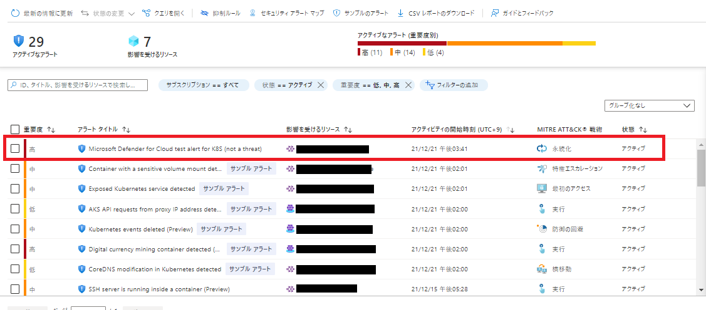

サンプルアラート詳細情報を確認した際と同様に、テストアラートの詳細情報も確認できます。

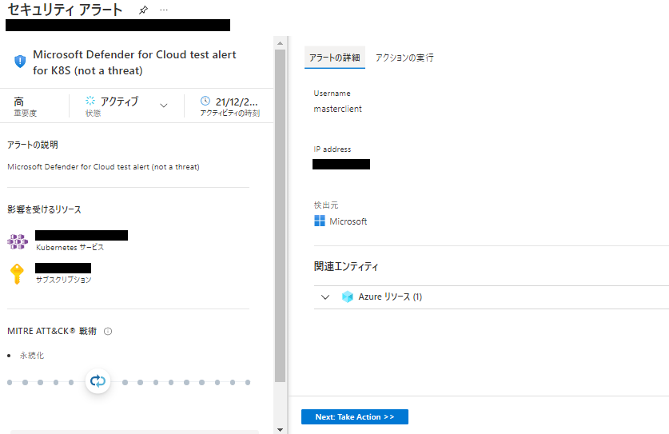

### 4.5. Pod レベルのテストアラートの検知  

### 4.5.1. Pod をデプロイ  

最後にクラスター内部で稼働している Pod(コンテナー) 上で特定のアクションを実行してテストアラートを発報させます。  
Cloud Shell 上の `kubectl` を利用します。  
Portal より Cloud Shell 上の `kubectl` で Kubernetes API へアクセスします。  

まずは、`kubectl run` で Pod をデプロイします。
デプロイ実行後は、`kubectl get pod` でデプロイした Pod のステータスが `Running` であることを確認してください。

```bash
$ kubectl run test-alert --image=nginx
pod/test-alert created

$ kubectl get pod
NAME         READY   STATUS              RESTARTS   AGE
test-alert   0/1     ContainerCreating   0          6s

$ kubectl get pod
NAME         READY   STATUS    RESTARTS   AGE
test-alert   1/1     Running   0          14s
```

`kubectl exec` で、Pod 上にて `apt` コマンドを実行してパッケージのインストールを実行します。  
指定のパッケージは、実在しないものなのでインストールに失敗します。  

```bash
$ kubectl exec -i test-alert -- apt update
$ kubectl exec -i test-alert -- apt install armitage
Reading package lists...
WARNING: apt does not have a stable CLI interface. Use with caution in scripts.

Building dependency tree...
Reading state information...
E: Unable to locate package armitage
command terminated with exit code 100
```

### 4.5.2. テストアラート確認  

サンプルアラートを確認した際と同様に、
Portal より Defender for Cloud サービス画面の `セキュリティ警告` メニューからアラートの一覧を参照します。

`kubectl` 実行からしばらく時間が経つと、アラート一覧より `Possible attack tool detected (Preview)` のテストアラートが表示されます。  
※ アラート表示まで、最大で 30 分程度の時間を要する場合があります。  

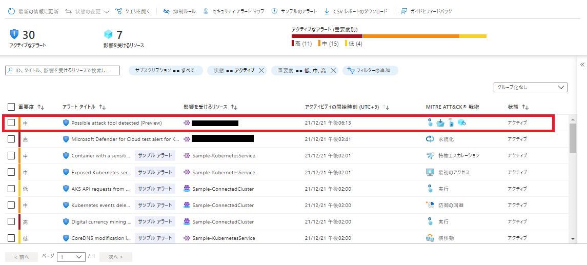

サンプルアラート詳細情報を確認した際と同様に、テストアラートの詳細情報も確認できます。


### 4.6. リソースのクリンナップ  

### 4.6.1. Microsoft Defender プランの無効化  

最後にチュートリアルで有効化したサービスの無効かとリソースのクリンナップを実施します。  

※このクリンナップを実施しない場合は、Defender for Containers と 作成した AKS クラスターを継続する利用することも可能です。
ただし、Defender for Containers とクラスターの利用料金が引き続き発生しますのでご留意ください。

まずは、Defender for Cloud のサービス画面へ遷移します。画面左部メニューより、`管理` -> `環境設定` を選択してください。その後 Defender for Containers を有効化した際と同様に、ツリーをドリルダウンで展開してチュートリアルで利用する `サブスクリプション` (鍵マーク)を選択してください。


`設定|Defender プラン` の画面が表示されます。  
画面右部を下へスクロールすると、Defender プランの一覧が表示されます。  
プラン一覧より `コンテナー` のスライドボタンを `オン` から `オフ` に変更してください。  変更後は、`保存` ボタンをクリックしてください。

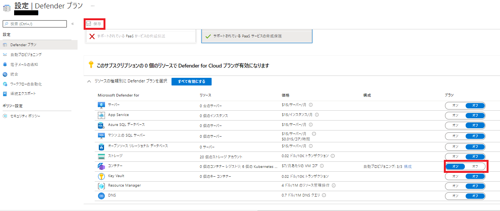

無効化(ダウングレード)実施直前に確認のメッセージが表示されます。  
`確認` ボタンをクリックしてください。

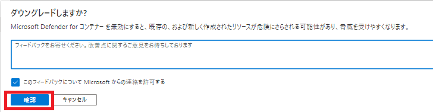

Portal 画面右上にて、対象サブスクリプションの `Defender プラン` (コンテナー)が正常に更新されたとのメッセージが確認できましたら無効化は完了です。

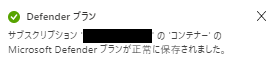

### 4.6.2. AKS クラスターの削除  

続いて、チュートリアル用に作成した AKS クラスターの削除を実施します。  
Cloud Shell で以下のコマンド実行してください。

```bash
$ az aks delete -n ${AKS_CLUSTER}
```

クラスター削除の実施完了後に、クラスターの一覧に該当のクラスター名が存在しないことを確認してください。

```bash
$ az aks list -o table
```

### 4.6.3. リソースグループの削除

チュートリアル用に作成したリソースグループの削除を実施します。  
Cloud Shell に以下のコマンド実行してください。

```bash
$ az group delete --name ${RESOUCE_GROUP}
```

リソースグループ削除実施後は、リソースグループの一覧から該当のリソースグループ名が存在しないことを確認してください。

```bash
$ az group list -o table
```

## コラム： AKS クラスターの保護機能のサービス構成の変遷

本章で解説の [Microsoft Defender for Containers](https://docs.microsoft.com/ja-jp/azure/defender-for-cloud/defender-for-containers-introduction?tabs=defender-for-container-arch-aks) は 2021 年 12 月にリリースされました。
その前進となる [Microsoft Defender for Kubernetes](https://docs.microsoft.com/ja-jp/azure/defender-for-cloud/defender-for-kubernetes-introduction) と [Microsoft Defender for container registries](https://docs.microsoft.com/ja-jp/azure/defender-for-cloud/defender-for-container-registries-introduction) の提供する機能を統合するサービスとなっています。統合前 / 統合後のサービス構成の変遷は以下となります。

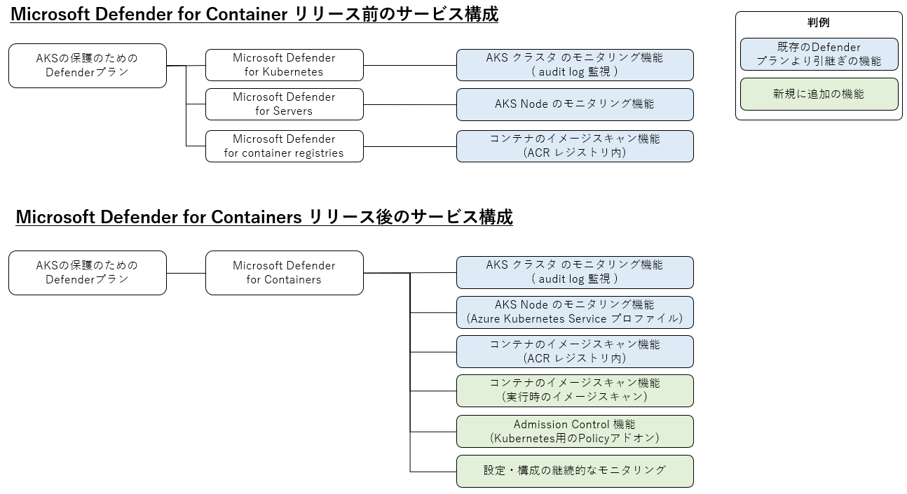

AKS Node のモニタリング機能の変遷について補足します。Microsoft Defender for Kubernetes + Microsoft Defender for container registries の旧構成で AKS を保護する際は、 AKS Worker Node の保護のために、 Microsoft Defender for Servers という仮想マシンを保護するための機能を別途組み合わせる必要がありました。これに対し、Microsoft Defender for Container では単独での AKS クラスターのセキュリティ保護が可能になりました。
