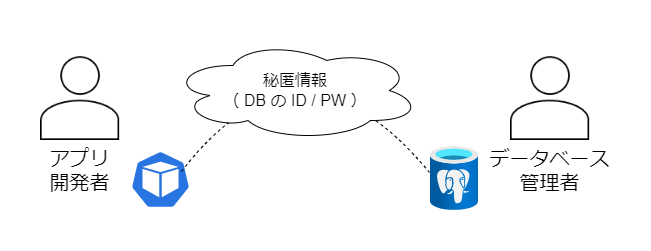
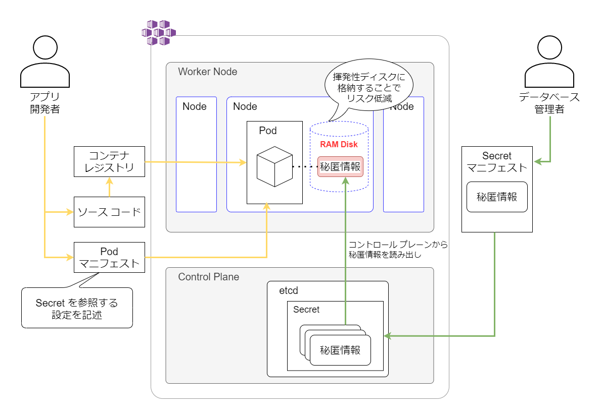
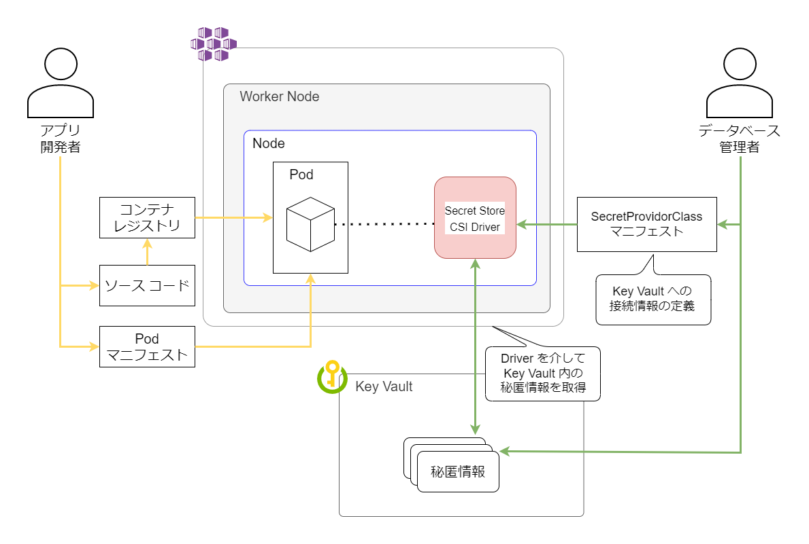
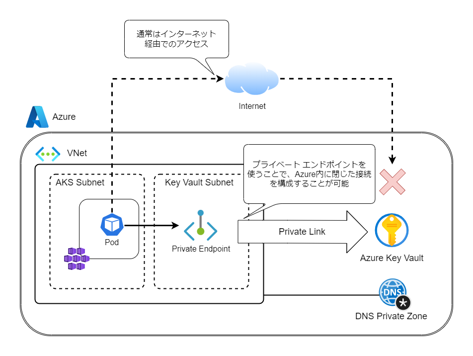
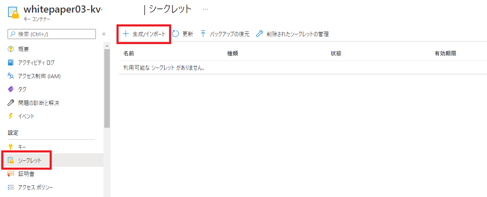
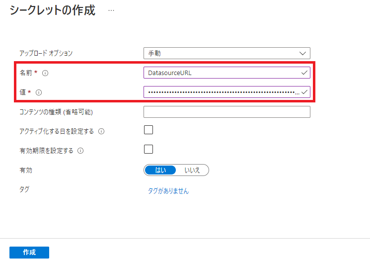
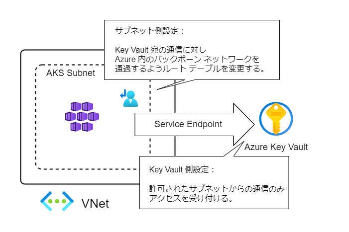
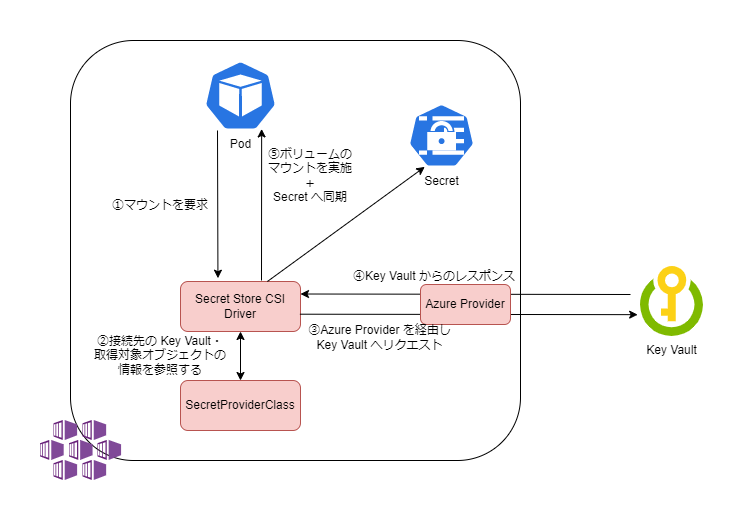

# 第3章 秘匿情報の管理

## 1. 本章の概要
近年ではクラウドを活用したシステム構築が一般的になり、インターネットの活用が大前提となりました。他社サービスや SaaS との密接な連携なども増加傾向にあり、ID やパスワードといった管理すべき秘匿情報の数は増大する傾向にあります。従来のオンプレミスのシステムではこれらの秘匿情報はネットワーク境界によって保護されていましたが、クラウドのシステムでは秘匿情報を安全かつ利便性を担保した形で取り扱わなければなりません。  
そこで本章では、**Azure Kubernetes Service** (以下 AKS) における秘匿情報を扱う際の注意点と、適切な管理について考えていきます。  

## 2. アプリケーションが持つ秘匿情報
本節では、秘匿情報を管理する際の課題についてを整理します。  
最初にアプリケーションが持つ秘匿情報には具体的にどのようなものがあるのかを検討します。次に、それらの秘匿情報を保護する際の選択肢について検討します。  

### 2.1. 秘匿情報の種類
アプリケーションが持つ秘匿情報の例として、以下のようなものが挙げられます。

- データベースへ接続するための認証情報
- API を呼び出す際の認証キー
- データの暗号化に用いる暗号鍵
- SSL/TLS のサーバー証明書

これらの情報が外部に漏洩することで、ビジネスに大きな損失が生じるリスクがあります。不正アクセスによる情報流出やサービスの乗っ取り、サービス停止に繋がります。そのため、秘匿情報を扱う際は適切な利用者のみがアクセスできるよう、権限/アクセス制御を厳密に管理する必要があります。

### 2.2. 秘匿情報の保護のアプローチ
次に秘匿情報を保管/利用するにあたり、どのような観点で保護すればよいかを解説します。秘匿情報の保護は大別して、以下の 2 つのアプローチがあります。 

1. 攻撃者が秘匿情報にアクセスできないようにする（データへのアクセスの防止）
2. 万が一アクセスを許してしまったとしてもデータを読めないようにする（データの不正な読み取りの防止）

高いセキュリティを維持するためには、1 つの観点のみで対策をするのではなく、複数の要素の対策を重ね合わせる多層防御の考え方が肝要です。そのため、これらの方法についても組み合わせて使うことをお勧めします。  

#### 2.2.1. データへのアクセスの防止
第一に、ネットワーク経路の制御や認可の権限を適切に設定し、攻撃者の秘匿情報へのアクセスを防ぐことを検討します。適切な経路からのアクセスや権限を持ったユーザーアカウントからのアクセスのみを許可することによって、権限を持たない攻撃者が秘匿情報にアクセスすることを防ぎます。

#### 2.2.2. データの不正な読み取りの防止
第二に、保持するデータを暗号化して不正な読み取りを防止することを検討します。これにより、アクセス防止の対策を抜けて攻撃者に保持するデータへのアクセスを許してしまったとしても、攻撃者がパスワードなどの秘匿情報を入手することを防止できます。


## 3. AKS 上のアプリケーションにおける秘匿情報の渡し方
前節の内容を踏まえ、本節では Kubernetes 上で動く Java アプリケーションを例に、秘匿情報をどのように渡すべきかを検討します。
代表的な秘匿情報であるデータベースへの接続情報を例として、実装方法を比較します。  

一例として、以下のようにアプリケーションの開発者とデータベース管理者がそれぞれ分かれている組織を想定します。アプリケーションがデータベースに接続するには認証のための ID /パスワードが必要ですが、それを管理しているのはデータベース管理者です。この体制において、安全に秘匿情報をやり取りするにはどのような手段を取るのがよいでしょうか。  

 

本節では、まずはじめに避けるべき方法を 3 点紹介し、その後よりセキュアな方法を 2 点解説します。

### 3.1. 避けるべき秘匿情報の扱い方

#### 3.1.1. Java プログラム内にハードコード
最も避けるべき方法は、秘匿情報をハードコードしてしまうことです。具体的にはデータベース管理者がアプリ開発者に秘匿情報を連携し、開発者がソースコード内に直接秘匿情報を書き込む方法です。

しかし、プログラム内に秘匿情報を埋め込んでしまうことで、ソースコードにアクセスできる人すべてが秘匿情報にアクセスできてしまいます。
一般的には、ほとんどのシーンでソースコードにアクセスできる人とデータベースにアクセスできる人は別の担当者です。
また、デプロイ先の環境ごとにソースコードを変更しなければならないことからも、ハードコードは避けるべきです。[Twelve-Factor App](https://12factor.net/ja/) においても、[アプリケーションのコードと環境に依存する設定は分離することが推奨されています](https://12factor.net/ja/config)。  

#### 3.1.2. Kubernetesのマニフェストに記載する
ソースコードと環境によって変わる設定値を分離する際によく利用される手法として、環境変数があります。  
Kubernetes では、マニフェストに以下のように [spec.containers.env](https://kubernetes.io/ja/docs/tasks/inject-data-application/define-environment-variable-container/) を記述することで環境変数の値を設定できます。

```yaml
apiVersion: v1
kind: Pod
metadata:
  name: demo
spec:
  containers:
  - name: demo
    image: alpine:latest
    command: ["sleep", "3600"]
    env:
    - name: SPRING_DATASOURCE_URL
      value: "jdbc:postgresql://exampledb.postgres.database.azure.com:5432/demo"
    - name: SPRING_DATASOURCE_USERNAME
      value: "spring@exampledb"
    - name: SPRING_DATASOURCE_PASSWORD
      value: "DUMMY_PASSWORD"
```

これによりソースコードからの秘匿情報の分離が可能となり、[3.1.1.](#311-java-プログラム内にハードコード)で述べた問題点は解決できます。
しかし、この記法ではマニフェスト内に平文で秘匿情報を記述することとなり、セキュリティを担保できません。したがって、これも非推奨な方法です。

#### 3.1.3. Kubernetes のConfigMap
Kubernetes には [ConfigMap](https://kubernetes.io/ja/docs/concepts/configuration/configmap/) と呼ばれる構成情報を扱うリソースが存在します。  
以下にマニフェストのサンプルを例示します。

```yaml
apiVersion: v1
kind: ConfigMap
metadata:
  name: demo-configmap
data:
  spring_datasource_url: "jdbc:postgresql://exampledb.postgres.database.azure.com:5432/demo"
  spring_datasource_username: "spring@exampledb"
  spring_datasource_password: "DUMMY_PASSWORD"
```

定義した ConfigMap は、valueFrom: を使うことで Pod の環境変数として設定可能です。環境変数以外にも、Pod にボリュームとしてマウントすることで、ファイルとして取り扱うことも可能です。

```yaml
apiVersion: v1
kind: Pod
metadata:
  name: demo
spec:
  containers:
  - name: demo
    image: alpine:latest
    command: ["sleep", "3600"]
    env:
    # valueFrom を使い configMap の値を環境変数に格納する例
    - name: SPRING_DATASOURCE_URL
      valueFrom:
        configMapKeyRef:
          name: demo-configmap
          key: spring_datasource_url
    - name: SPRING_DATASOURCE_USERNAME
      valueFrom:
        configMapKeyRef:
          name: demo-configmap
          key: spring_datasource_username
    - name: SPRING_DATASOURCE_PASSWORD
      valueFrom:
        configMapKeyRef:
          name: demo-configmap
          key: spring_datasource_password
```
ConfigMap を利用することによって、Kubernetes のマニフェストと設定情報を分割できます。これにより、アプリ開発者とデータベース管理者の役割を分担できるようになります。  

下図では、データベース管理者が ConfigMap に秘匿情報をセットし、アプリ開発者は Pod に ConfigMap を割り当てるという状況を表しています。このように作業を分担することで、データベース管理者とアプリ開発者との間で秘匿情報を伝達する必要がなくなります。  

   

一方、[3.1.2.](#312-kubernetesのマニフェストに記載する)で述べた欠点と同様、ConfigMap のマニフェストには秘匿情報を平文で記述する必要があり、こちらも実用的な手法ではありません。  

また、ConfigMap は秘匿情報を扱うためのものではなく、情報の保護の観点で脆弱な箇所があります。一例として、Pod に ConfigMap をマウントした際にワーカー ノードのローカルディスクに情報が書き込まれることから、そこから情報を復元できてしまうリスクがあります。ConfigMap を利用する場合は秘匿する必要のない構成情報の格納のみに留めておきましょう。  
具体的なケースとして、Spring Boot を用いた開発で application.properties ファイルに構成情報を記述し ConfigMap に格納する、という事例があります。この場合も上記理由から、秘匿する必要のない一般的な設定パラメーターのみを application.properties ファイルに記述するべきです。秘匿すべき情報は以降で述べるベスト プラクティスに沿って取り扱いましょう。

#### 3.1.4. Kubernetes のSecret

Kubernetes には秘匿情報を扱うためのリソースとして [Secret](https://kubernetes.io/ja/docs/concepts/configuration/secret/) が存在します。

以下にマニフェストのサンプルを例示します。ConfigMap と近い形で定義しますが、Secret は Base64 でエンコードした値を格納します。

```yaml
apiVersion: v1
kind: Secret
metadata:
  name: demo-secret
type: Opaque
data:
  # Secret では value に Base64 でエンコードされた値を使う 
  spring_datasource_url: amRiYzpwb3N0Z3Jlc3FsOi8vZXhhbXBsZWRiLnBvc3RncmVzLmRhdGFiYXNlLmF6dXJlLmNvbTo1
  spring_datasource_username: c3ByaW5nQGV4YW1wbGVkYgo=
  spring_datasource_password: RFVNTVlfUEFTU1dPUkQK
```

Pod からの利用も ConfigMap と同様に環境変数として参照可能です。

```yaml
apiVersion: v1
kind: Pod
metadata:
  name: demo
spec:
  containers:
  - name: demo
    image: alpine:latest
    command: ["sleep", "3600"]
    env:
    # valueFrom と secretKeyRef を使い configMap の値を環境変数に格納する例
    - name: SPRING_DATASOURCE_URL
      valueFrom:
        secretKeyRef:
          name: demo-secret
          key: spring_datasource_url
    - name: SPRING_DATASOURCE_USERNAME
      valueFrom:
        secretKeyRef:
          name: demo-secret
          key: spring_datasource_username
    - name: SPRING_DATASOURCE_PASSWORD
      valueFrom:
        secretKeyRef:
          name: demo-secret
          key: spring_datasource_password
```

Kubernetes で秘匿情報を扱う際は Secret リソースを利用するのが一般的な手法です。Secret は秘匿情報を扱うためのリソースとして設計されています。  

ConfigMap Secret の差分の一例として、データの格納方式の違いが挙げられます。ConfigMap では読み出したデータは Worker ノードのディスクに格納されていました。それに対し Secret の場合、データはメモリ上の一時的なファイルシステム（RAM ディスク）に格納されます。これによりローカル ディスクへの格納時に発生しうるデータ復元のリスクを抑止することができます。  

  

ただし、マニフェスト内の値は Base64 でエンコードされているのみで簡単にデコードできてしまいます。ConfigMap と同様、Secret リソースのマニフェストの扱いには注意が必要です。Git のリポジトリにプッシュするなど、不用意に人目に晒すことのないよう注意する必要があります。

このような理由から、Secret で確保可能なセキュリティ強度は限定的なものとなります。次に紹介する Key Vault を利用する方法を積極的に検討しましょう。


### 3.2. 秘匿情報取り扱いのベスト プラクティス

#### 3.2.1. Key Vaultの利用

Azure には [Key Vault](https://azure.microsoft.com/ja-jp/services/key-vault/) という秘匿情報を扱うためのマネージドサービスがあります。  
Key Vault に格納した秘匿情報は暗号化して保存されます。また、Key Vault では秘匿情報に対するアクセス許可を細やかに設定できます。  
格納された秘匿情報は Azure によって業界標準のアルゴリズムとキーの長さを使用して自動的に保護されます。そのため、保管時の暗号化についてユーザー側で意識する必要はありません。アクセス制御の観点は後の節で解説します。 

AKS は[シークレット ストア CSI ドライバー](https://secrets-store-csi-driver.sigs.k8s.io/)と呼ばれる仕組みを通じ、Key Vault 上の秘匿情報を Pod に取得させることができます。  
この仕組みを利用することによって秘匿情報を完全に Kubernetes から分離できます。データベース管理者は秘匿情報を Key Vault にのみ格納することで、[3.2.1](#321-kubernetes-のsecret)で述べた Secret のマニフェストの取り扱いに関する懸念を払拭できます。  

シークレット ストア CSI ドライバーの詳細に関して章末にコラムとして解説していますので、そちらも合わせてご参照ください。  

  

本章の以降の節では、AKS と Key Vault を統合して利用する際のセキュリティ確保の要点について解説していきます。

## 4. AKS × Key Vault 連携時のセキュリティ確保の観点
本節では前節で述べた AKS を Key Vault と連携させる方式を採用する際の、
セキュリティ確保のポイントを２点解説します。

- アクセス ポリシーによる権限の管理
- プライベート エンドポイントを使ったネットワークの閉域化

以降の節でそれぞれの機能を解説します。


### 4.1. Key Vault に対するアクセス ポリシー
AKS 上のアプリケーションから Key Vault 内の秘匿情報に対しアクセスする際に、秘匿情報にアクセスする権利を有していることを確認する必要があります。  
Key Vault では以下の 2 種類のアクセス許可モデルのどちらかを設定できます。

- コンテナーのアクセス ポリシー
- Azure ロールベースのアクセス制御（RBAC）

どちらも Azure Active Directory（以下、Azure AD と表記）による認証を利用します。  
両者の大きな差異は認可の設定方法です。  
前者は個々の Key Vault リソースに対し、誰にどういった操作権限を割り当てるかを個別に設定できます。  
一方後者の RBAC では、Azure の IAM 設定として Key Vault に対する権限を設定できます。サブスクリプションやリソースグループといった広い範囲から、Key Vault 内の個々の秘匿情報に対してまで細やかに設定が可能です。  
特に理由がなければ、後者の RBAC を利用するのがよいでしょう。

### 4.2. Key Vault に対するネットワーク制御
次に、Key Vault に対するネットワーク観点でのアクセス制御を解説します。  
Key Vault は通常インターネット経由でアクセスするサービスですが、Azure 環境からセキュアなアクセスを行うために「プライベート エンドポイント」と呼ばれる設定が存在します。  

プライベート エンドポイントは、Key Vault との接続をインターネット経由ではなく VNet 経由でのクローズな接続に変更する機能です。VNet 内にネットワーク インターフェースを接続しプライベートな IP アドレスを付与することで、VNet からのアクセスを受け付けることが可能です。  
接続の概要は下図のとおりです。プライベート エンドポイントを構成するとプライベート専用の FQDN「*.privatelink.vaultcore.azure.net」が付与されます。その名前解決のためにプライベート DNS ゾーンを組み合わせるのが一般的な構成です。  
  


## 5. チュートリアル
本節では、前節で述べた AKS と Key Vault の連携についてのチュートリアルを行います。  
チュートリアルでは以下の構成を Azure 上にプロビジョニングします。  
  
この環境上でサンプル アプリケーションを起動します。以下の図の流れで、Key Vault の中に格納した認証情報を利用してデータベースへの接続を実現します。  
  


### 5.1. 環境のプロビジョニング
環境のプロビジョニングについては、[こちらのページ](codes/chapter03/README.md) をご参照ください。

### 5.2. サンプルアプリケーション
サンプルアプリケーションとして、Azure-Samples のリポジトリで公開されている、[quickstart-spring-data-jdbc-postgresql](https://github.com/Azure-Samples/quickstart-spring-data-jdbc-postgresql)を利用します。POST メソッドでリクエストされた内容をデータベースに登録し、GET メソッドでデータベースに登録された内容を返すシンプルなアプリケーションです。データベースへの接続のための認証情報を、以下の 3 個の環境変数として与える必要があります。

- SPRING_DATASOURCE_URL
- SPRING_DATASOURCE_USERNAME
- SPRING_DATASOURCE_PASSWORD

本アプリケーションはコンテナーとして公開されていないため、コンテナー イメージをビルドする必要があります。本リポジトリの [codes/chapter03/sampleapp](codes/chapter03/sampleapp) ディレクトリ配下に、イメージ ビルド用の [Dockerfile](codes/chapter03/sampleapp/Dockerfile) を配置しています。作業用の Linux VM に Dockerfile を配置し、Dockerfile を配置したディレクトリで以下のコマンドでイメージをビルドしてください。  

\${ACRNAME} を [5.1.](#51-環境のプロビジョニング) で作成した Azure Container Registry (以下 ACR)の名前に置き換えて実行してください。

```shell
$ docker build -t ${ACRNAME}.azurecr.io/sampleapp .
```

問題なくビルドが完了したら、ACR へプッシュします。

```shell
# ACR へのログイン
$ az acr login --name ${ACRNAME}
# ACR へイメージをプッシュ
$ docker push ${ACRNAME}.azurecr.io/sampleapp:latest
```

### 5.3. Key Vaultへ秘匿情報を保存する
続いて、アプリケーションが利用する秘匿情報を Key Vault へ格納します。
作業用の Linux VM から、以下のコマンドを実行します。

\${KEYVAULTNAME} を作成した Key Vault の名前に、\${DATABASENAME} を作成したデータベースの名前にそれぞれ置き換えて実行してください。

```bash
$ az keyvault secret set --vault-name ${KEYVAULTNAME} --name DatasourceURL --value "jdbc:postgresql://${DATABASENAME}.postgres.database.azure.com:5432/postgres"
$ az keyvault secret set --vault-name ${KEYVAULTNAME} --name DatasourceUsername --value 'spring'
$ az keyvault secret set --vault-name ${KEYVAULTNAME} --name DatasourcePassword --value 'ThisIsTest#123'
```

※ Azure ポータルから秘匿情報を保存する場合は以下のように行います。
該当の Key Vault リソースの左メニューから「シークレット」をクリックし、上部の「生成/インポート」をクリックします。
  

シークレットの作成 画面でパラメーターを入力します。名前欄に Key Vault 内で管理するための名前（上記コマンドの `--name` で指定した値）、値欄に秘匿情報（上記コマンドの `--value` で指定した値）を入力します。  
  


Key Vault への登録が完了したら、SecretProvidorClass のマニフェストを作成します。以下サンプルの \${KEYVAULTNAME} , \${MANAGEDID} , \${TENANTID} を、それぞれ Key Vault の名前, AKS のマネージド ID , テナントの ID に置き換えてください。

```yaml
apiVersion: secrets-store.csi.x-k8s.io/v1
kind: SecretProviderClass
metadata:
  name: sample-spc
spec:
  provider: azure
  parameters:
    keyvaultName: ${KEYVAULTNAME}
    useVMManagedIdentity: "true"
    userAssignedIdentityID: ${MANAGEDID}
    tenantId: ${TENANTID}
    objects: |
      array:
      - |
        objectName: DatasourceURL
        objectType: secret
      - |
        objectName: DatasourceUsername
        objectType: secret
      - |
        objectName: DatasourcePassword
        objectType: secret
  secretObjects:
  - secretName: sample-secret
    type: Opaque
    data: 
    - objectName: DatasourceURL
      key: DATASOURCE_URL
    - objectName: DatasourceUsername
      key: DATASOURCE_USERNAME
    - objectName: DatasourcePassword
      key: DATASOURCE_PASSWORD
```

作成したマニフェストを AKS に登録します。

```bash
$ kubectl apply -f SecretProvidorClass.yaml
```

### 5.4. サンプルアプリのデプロイと秘匿情報へのアクセスの確認
[5.2.](#52-サンプルアプリケーション) でビルドしたコンテナー イメージを、AKS にデプロイします。  
サンプル用のマニフェストを本リポジトリの [codes/chapter03/sampleapp](codes/chapter03/sampleapp) ディレクトリ配下に、[sampleapp.yaml](codes/chapter03/sampleapp/sampleapp.yaml) として準備しました。マニフェスト内の \${ACRNAME} を作成した ACR の名前に置き換えてから、以下コマンドを実行してください。

```bash
$ kubectl apply -f sampleapp.yaml
```

Pod のステータスが Running に変わるまで待機します。

```bash
$ kubectl get pod -w
NAME                         READY   STATUS         RESTARTS   AGE
sampleapp-6684787898-ssdfc   1/1     Running        0          1m
```

Running になった後もアプリケーションが完全に起動するまでには時間を要します。ログを確認し、 "Started DemoApplication" の文字列が出力されるまで待機します。

```bash
$ kubectl logs -f sampleapp-6684787898-ssdfc
2022-04-13 11:50:08.902  INFO 56 --- [           main] com.zaxxer.hikari.HikariDataSource       : HikariPool-1 - Start completed.
2022-04-13 11:50:09.304  INFO 56 --- [           main] o.s.s.concurrent.ThreadPoolTaskExecutor  : Initializing ExecutorService 'applicationTaskExecutor'
2022-04-13 11:50:09.413  INFO 56 --- [           main] o.s.b.w.embedded.tomcat.TomcatWebServer  : Tomcat started on port(s): 8080 (http) with context path ''
2022-04-13 11:50:09.421  INFO 56 --- [           main] com.example.demo.DemoApplication         : Started DemoApplication in 2.087 seconds (JVM running for 2.339)
```

アプリケーションが起動したら、curl コマンドを用いて動作確認を行います。

```bash
# 通信先の IP アドレスを確認する。"EXTERNAL-IP" 列の値である 203.0.113.1 が通信先の IP アドレスとなる。
$ kubectl get svc sampleapp
NAME        TYPE           CLUSTER-IP     EXTERNAL-IP    PORT(S)          AGE
sampleapp   LoadBalancer   10.0.141.167   203.0.113.1    8080:30392/TCP   5m19s

# データベースへの登録
$ curl --header "Content-Type: application/json" \
    --request POST \
    --data '{"description":"configuration","details":"congratulations, you have set up JDBC correctly!","done": "true"}' \
    http://203.0.113.1:8080

# データベース内に登録した情報の取得
$ curl http://203.0.113.1:8080
> [{"id":1,"description":"configuration","details":"congratulations, you have set up JDBC correctly!","done":true}]
```

ここまでの流れで、Key Vault のみにデータベースへの接続情報が保存されており、AKS には秘匿情報はなく Key Vault への参照設定があるのみである点に注目してください。

### 5.5. 環境クリーンアップ
以下の手順を実行し、デプロイした Azure リソースを削除してください。

```shell
# リソースグループを削除
$ az group delete --name $resourcegroupname
```

---

## コラム：プライベート エンドポイントとサービス エンドポイントの差異
[4.2.](#42-key-vault-に対するネットワーク制御)でプライベート エンドポイントについて解説しましたが、類似のサービスとして「サービス エンドポイント」が存在します。  
サービス エンドポイントはサブネットに対しルート テーブルを変更し、インターネット経由ではなく Azure 内のバックボーン ネットワークを経由するよう接続経路を変更します。  
  
プライベート エンドポイントとサービス エンドポイントはどちらも Azure 内部での直接接続を提供するサービスですが、以下のような差異があります。

|項目|プライベート エンドポイント|サービス エンドポイント
|---|---|---|
|接続先 IP アドレス| プライベート IP| パブリック IP |
|アクセス許可単位| VNet (ピアリング先のネットワーク含む) | サブネット |
|DNS 設定| 必要 | 不要 |
|欠点| NSG によるアクセス制御ができないため、<br>接続されたネットワークすべてからアクセスできてしまう | 複数の Key Vault を利用する際は、<br>全ての Key Vault でサービス エンドポイントを有効にする必要がある<br>（一部の Key Vault のみインターネット経由といった使い分けはできない）

本章のチュートリアルではプライベート エンドポイントを採用しましたが、適用するネットワークの要件に合わせ最適なサービスを選択しましょう。

## コラム：シークレット ストア CSI ドライバー
シークレット ストア CSI ドライバーは、Pod から Key Vault のような外部のシークレットストアに対するアクセスを可能とします。CSI(Container Storage Interface) を通じたアクセスを提供するため、Pod からはボリュームとしてシークレットストアをマウントし秘匿情報にアクセスできます。  
シークレット ストア CSI ドライバーは Azure 特有の機能ではなく OSS として開発されています。各クラウド ベンダーのシークレット ストア サービスに対応させるためのプロバイダーが存在し、Key Vault 用のプロバイダーは Azure の GitHub リポジトリにて公開されています。  
https://github.com/Azure/secrets-store-csi-driver-provider-azure

シークレット ストア CSI ドライバーは秘匿情報を Kubernetes の Secret に同期する機能を持ちます。以下の図のような流れで、ボリュームのマウントを行うタイミングで Secret に同期できます。この Secret は参照する Pod がなくなった時点で削除されるため、個別にライフ サイクルを管理する必要はありません。

  