# 第4章 セキュアなCI/CDパイプラインの構築

## 1. 本章の概要

クラウドネイティブな開発においては、開発のベロシティを保つために DevOps の開発スタイルを採用することがベストプラクティスとされています。  

DevOps は開発時の生産性を改善するモチベーションで発案された概念ですが、近年ではその枠組みの中でセキュリティを担保する試みが模索されており、DevSecOps と呼称されています。  

DevSecOps はセキュリティの観点を開発初期の段階から取り入れることで、開発とリリースのサイクルの中でセキュリティの品質を保つアプローチです。CI/CD パイプラインにセキュリティチェックを追加することで、継続的にセキュリティを評価することが代表的なプラクティスです。  

本章では DevSecOps の考え方を踏まえつつ、Kubernetes を用いたシステム開発において、各工程で注意すべきセキュリティ課題とそれらを解消するための Azure サービスの利用について解説します。  


## 2. CI/CD × Kubernetes のセキュリティに関する観点
まず最初に、クラウドネイティブな開発における開発フローと体制/ロールを、セキュリティの観点で概観していきましょう。
CI/CD の各工程において、それぞれの担当がどの領域の役割を果たすかを図式化したものを示します。従来の開発スタイルでは開発・運用といった縦割りのロールが存在し、業務範囲が明確に分離していました。それに対して DevSecOps の開発スタイルにおいてはそれぞれのロールが協調してシステムを作り上げていきます。そのため、CI/CD のすべての段階において各ロールが協力して業務を進めていく必要があります。  

下図はそれぞれの工程の中での各担当者のロールの一例です。すべての工程に全ロールの担当者が関与していきますが、関与の度合いを色付けして表現しています。セキュリティ担当は CI/CD の全体を通じ、セキュリティ面を支える役割を担います。開発担当は主に前半の要件定義からテストを重点的に行い、運用担当は主にテスト以降の運用およびモニタリングの役割を担います。  

  

上図では便宜上各工程を一直線に並べて表現していますが、実際のプロダクト開発においてはこれらの工程をサイクルとして繰り返していき品質を高めていきます。以下の図に表現するように、運用後のモニタリングで得たフィードバックが次の改善の要件定義に繋がります。  


### 2.1. セキュリティ担当が注意すべき事項
従来の開発手法では、開発が完了した後のリリース前段階で脆弱性診断をするパターンが多くありました。しかし、リリース直前で見つかった脆弱性を修正すると手戻りが多くなり、工数の増大に繋がります。そのため、開発の早期段階で脆弱性を検知し手戻り・修正工数を少なくする [Shift Left](https://docs.microsoft.com/ja-jp/devops/develop/shift-left-make-testing-fast-reliable#shift-left) と呼ばれる手法が近年注目されています。本節の冒頭に挙げた図でセキュリティ担当の範囲が広く全体に伸ばしていますが、これは Shift Left の考え方を表したものです。  

セキュリティ担当は守るべきセキュリティのポリシーやガイドラインを定め、システム全体のセキュリティの統制をとります。開発の早期段階から運用の工程まで幅広い範囲を担当することとなるため、全てを人手で行うのではなくポリシーをチェックするための仕組みを提供することも役割のひとつとなるでしょう。

### 2.2. 開発担当が注意すべき事項
開発担当は要件定義からアプリケーションの開発、成果物のビルドとテストの工程を重点的に担います。Kubernetes を利用したシステムにおける成果物は、ソースコードをビルドしたバイナリだけでなくコンテナー イメージも含まれます。  

開発担当が受け持つ工程で注意すべきことは、成果物への脆弱性の混入です。自身が作成するアプリケーションをセキュアに作ることは不可欠ですが、外部のライブラリーやランタイムを利用する際に、それらに既知の脆弱性が含まれていないことを確認する必要があります。また、アプリケーションをコンテナー化する際にも、コンテナー内に脆弱性が混入していないか注意が必要です。ベースとするコンテナー イメージが安全であること、ベースに対し追加するパッケージが安全であることを確認しましょう。

### 2.3. 運用担当が注意すべき事項
運用担当は開発担当から成果物を受け取り本番環境へ配置し、それを運用する工程を主に担います。Kubernetes を利用したシステムにおいては、ビルドしたコンテナー イメージをクラスターへ Pod として配置することがデプロイにあたります。  
開発担当がいかにセキュアなコンテナー イメージを作成したとしても、脆弱な設定で Pod を稼働させてしまっては意味がありません。
脆弱な設定の例を以下に列挙します。

- プロセスを実行するユーザーが、不必要に強い権限を持ったユーザーとなっている
- コンテナーのファイルシステムを書き込み可能な状態でマウントする
- CPU やメモリのリソース使用量上限の設定がない状態で Pod を起動する

また、開発工程では発見されていなかった脆弱性が、運用工程で発見されることもあります。システムが健全であるか、継続的にモニタリングを行うことも重要なポイントです。

## 3. 参照アーキテクチャー
前節では各担当別の注意点についてを解説しました。Azure にはそれらの課題解決をサポートするためのサービスが存在します。  
本節では、Azure のサービスを利用した CI/CD パイプラインを例示し、その要素となる Azure サービスを解説します。


### 3.1. Microsoft Defender for Containers - イメージの脆弱性スキャン
[2.2.節](#22-開発担当が注意すべき事項)で述べた開発担当の注意点である **成果物への脆弱性混入** を防ぐためのサービスが、[Microsoft Defender for Containers (以下 Defender for Containers)](https://docs.microsoft.com/ja-jp/azure/defender-for-cloud/defender-for-containers-introduction) の脆弱性スキャン機能です。Defender for Containers については既に[第2章](chapter02.md)でも触れているとおり、**Azure Kubernetes Service** (以下 AKS)  を中心としたコンテナー サービスに対するセキュリティ保護を提供するサービスです。Defender for Containers は豊富な機能を持つサービスですが、本章ではコンテナー イメージの脆弱性スキャン機能にフォーカスして解説します。  

Azure 上でコンテナー ワークロードを稼働させる際は、コンテナー イメージを Azure Container Registry（以下 ACR）に格納する方式が一般的です。Defender for Containers は ACR に格納されたイメージの脆弱性スキャンを行う機能を提供します。また、GitHub Actions を利用し、CI/CD パイプライン内で脆弱性スキャンを行うことも可能です。  

参照アーキテクチャーの中では CI/CD パイプライン内でスキャン機能を利用しています。イメージ内に脆弱性が検知された場合はレビュー用の ACR へ隔離し、脆弱性の検知されなかった安全なイメージのみを本番用 ACR へ格納します。

※ CI/CD パイプライン内での脆弱性スキャン機能は、本章執筆時の 2022 年 4 月時点でプレビュー中の機能です。

### 3.2. Azure Policy - 脆弱な設定の抑止
[2.3.節](#23-運用担当が注意すべき事項)で述べた運用担当の注意点、 **脆弱な設定での Pod の稼働** を防ぐために [Azure Policy](https://docs.microsoft.com/ja-jp/azure/governance/policy/overview) を利用します。こちらも[第2章](chapter02.md)で触れている内容ですが、Azure Policy はあらかじめ定義したポリシーに反する設定がなされたワークロードの実行をブロックします。  
参照アーキテクチャーにおいては、本番環境へ Pod をデプロイする前にステージング環境でポリシーとの適合を確認する、という用途で利用しています。

### 3.3. Microsoft Sentinel - セキュリティ分析と脅威のモニタリング
[Microsoft Sentinel（以下 Sentinel）](https://docs.microsoft.com/ja-jp/azure/sentinel/overview) は Microsoft が提供する SIEM（セキュリティ情報イベント管理）サービスです。情報を集約・蓄積し、そのデータを分析することで脅威の兆候を検出します。
今回の参照アーキテクチャーの中では、デプロイ後のセキュリティ脅威の検知に利用します。  


## 4. チュートリアル
前節で示した参照アーキテクチャーの内容を基に、順序を追って具体的な Azure サービスの利用法を確認していきます。  

チュートリアルの中で Azure ・ GitHub に対する操作を行います。次項に進む前に Azure のアカウント・GitHub のアカウントを予めご準備ください。  

**チュートリアルの概要**  
本チュートリアルの概要は以下となります。  

- チュートリアル環境用の Azure リソースの作成
- Azure サービスの有効化
- Defender for Containers によるイメージ スキャン
- Azure Policy による防御


### 4.1. チュートリアル環境用の Azure リソースの作成
環境のプロビジョニングについては、[こちらのページ](codes/chapter04/README.md) をご参照ください。

### 4.2. Azure サービスの有効化
セキュリティに関する Azure サービスの有効化を行います。  

※ 本節で設定する Microsoft Defender はサブスクリプション単位で設定するサービスです。既に存在するリソースを含めサブスクリプション全体に対し有効化される点にご注意ください。

#### 4.2.1. Microsoft Defender for Containers の有効化

Portal 画面上部の検索ボックスにて `defender` と入力し、  
検索候補として表示される `Microsoft Defender for Cloud` をクリックしてください。  
Defender for Cloud のサービス画面へ遷移します。


有効化を反映する対象サブスクリプションを選択します。  
画面左部メニューより、`管理` -> `環境設定` を選択してください。
画面右部にテナント / アカウント / サブスクリプションのツリーが表示されます。
ツリーをドリルダウンで展開してチュートリアルで利用する `サブスクリプション` (鍵マーク)を選択してください。


`設定|Defender プラン` の画面が表示されます。  
画面右部を下へスクロールすると、`Defender プラン` の一覧が表示されます。  
プラン一覧より `コンテナー` のスライドボタンを `オフ` から `オン` に変更してください。  
変更後は、`保存` ボタンをクリックしてください。


Portal 画面右上にて、対象サブスクリプションの `Defender プラン` (コンテナー)が正常に更新されたとのメッセージが確認できましたら有効化は完了です。


チュートリアル実施前から Defender for Containers を有効化されている場合は Defender プランをアップグレードする必要がある場合があります。  
Defender for Cloud サービス画面にて以下のようにアップグレードを推奨するメッセージが表示されている場合は、アップグレードを実施してから次へ進んでください。

※ 推奨メッセージが表示されていない場合は、アップグレード対応は不要です。  


  

#### 4.2.2. Microsoft Defender for container registries の有効化

コンテナー イメージの脆弱性検知に利用する CI/CD スキャン機能は、2022 年 4 月時点では Defender for Cloud の前身である Microsoft Defender for container registries (以下 Defender for container registries) によって提供されています。
そのため Defender for Cloud だけでなく、Defender for container registries も有効化する必要があります。  

Defender for container registries はポータルから有効化できないため、CLI を利用します。

```bash
$ az provider register --namespace 'Microsoft.Security'
$ az security pricing create -n ContainerRegistry --tier 'standard'
```

CLI を実行した後は、ポータル上から状態を確認できます。  

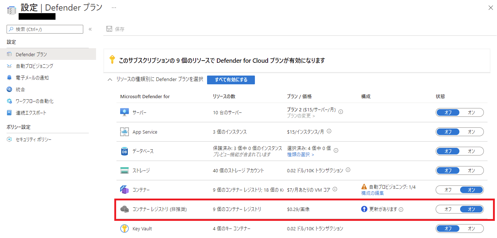  

続いて、CI/CD パイプラインで利用する情報を取得します。  
イメージスキャンの結果をポータル上に表示させるため、Defender for Cloud に統合された Application Insights へスキャン結果を連携します。Application Insights にスキャン結果を連携するために、接続・認証用情報を得る必要があります。  

`設定|Defender プラン` の画面から左メニューの `統合` -> `CI/CD 統合の構成` をクリックします。

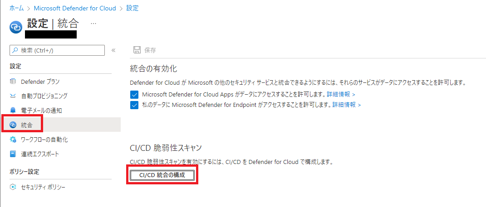  

表示された `CI/CD 構成` 画面から `認証トークン` と `接続文字列` をコピーし控えておきます。この値は CI/CD パイプライン構築の工程で使用します。  

※ Application Insights の既定のワークスペース リージョンは、`西ヨーロッパ` と `米国西部 2` のどちらかを選択します。作成する AKS や ACR のリージョンと一致させる必要はありません。  


### 4.3. Defender for Containers によるイメージ スキャン

本節では **Defender for Containers** を利用してコンテナー イメージのスキャンを行います。前節で図示した参照アーキテクチャー内の以下箇所が対象です。  
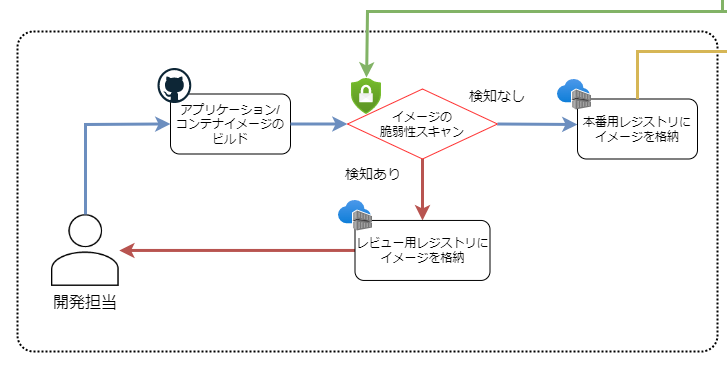  

最初に GitHub のリポジトリと GitHub Actions のパイプラインを作成します。
その後、実際に脆弱性を含んだコンテナー イメージのビルドを行い、Defender for Containers のスキャン機能によって検知されることを確認します。

#### 4.3.1. GitHub Actions による パイプラインの構築
[GitHub](https://github.co.jp/) 上で新規リポジトリを作成し、リポジトリをローカル環境にクローンします。クローン後、初期ブランチとして main ブランチを作成します。  

```bash
$ git clone git@github.com:<アカウント名>/<リポジトリ名>.git

# main ブランチの作成
$ cd <リポジトリ名>
$ git commit --allow-empty -m "initial commit"
$ git branch -m main

# GitHub へ Push
$ git push --set-upstream origin main
```

クローンしたローカル環境上にワークフロー ファイルを配置します。ワークフロー ファイルは本リポジトリの [codes/chapter04/github_workflow](codes/chapter04/github_workflow) 配下の [build_and_scan.yaml](codes/chapter04/github_workflow/build_and_scan.yaml) を使用します。  
以下のディレクトリ構造を作成し、ファイルを配置してください。  

```
.
└── .github
    └── workflows
        └── build_and_scan.yaml
```

GitHub Actions から ACR にコンテナー イメージをプッシュできるようにするため、[Open ID Connect](https://docs.microsoft.com/ja-jp/azure/developer/github/connect-from-azure?tabs=azure-portal%2Clinux#use-the-azure-login-action-with-openid-connect) を利用します。  
Open ID Connect で利用するサービスプリンシパルを作成します。下記コマンド内の `${subscriptionId}` と `${rgName}` をそれぞれ Azure サブスクリプション ID 、リソースグループ名 に置き換えて実行してください。

```bash
$ az ad sp create-for-rbac --name "GitHub_Actions_AcrPush" --role AcrPush --scopes /subscriptions/${subscriptionId}/resourceGroups/${rgName}
```
コマンド出力結果は後ほど使用するため、参照できるよう保管します。

```json
{
  "appId": "########-####-####-####-############",
  "displayName": "GitHub_Actions_AcrPush",
  "password": "*************************",
  "tenant": "########-####-####-####-############"
}
```

次にブラウザで Azure ポータルを開き、 `Azure Active Direcroty` -> `アプリの登録` とクリックします。
`所有しているアプリケーション` 欄から先ほど作成した **GitHub_Actions_AcrPush** を探し、名前をクリックします。  

`GitHub_Actions_AcrPush` のページにて、`証明書とシークレット` -> `フェデレーション資格情報` と遷移し、 `資格情報の追加` をクリックします。
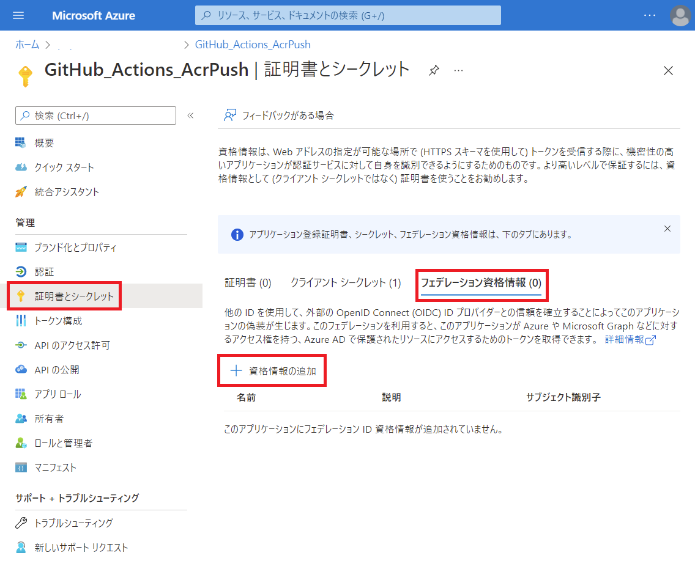

入力項目に以下の値を入力します。

| 項目 | 入力値 |
| - | - |
| フェデレーション資格情報のシナリオ | Azure リソースをデプロイする GitHub Actions |
| 組織 | GitHub のユーザー名 |
| リポジトリ名 | GitHub のリポジトリ名 |
| エンティティ型 | ブランチ |
| GitHub ブランチ名 | main |
| 名前 | GitHub_Actions_AcrPush |

入力が完了したら `保存` をクリックします。  
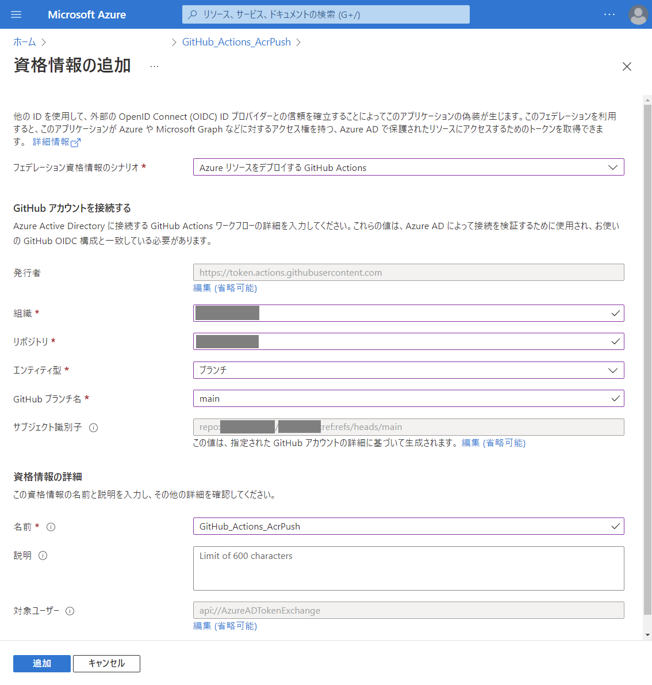  


続いて、GitHub Actions で使う Secrets を定義します。作成した GitHub リポジトリにて `Settings` -> `Secrets` -> `Actions` とクリックし、設定画面を開きます。  

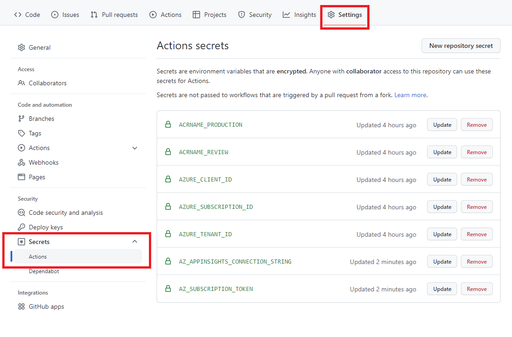


画面上の `New Repository secret` をクリックし、以下 7 個の Secret を作成します。  

| Name | Value |
| - | - |
| ACRNAME_PRODUCTION | 本番用 ACR 名 |
| ACRNAME_REVIEW | レビュー用 ACR 名 |
| AZURE_CLIENT_ID | サービスプリンシパル作成時の出力結果 `appId` の値 |
| AZURE_SUBSCRIPTION_ID | Azure サブスクリプションの ID |
| AZURE_TENANT_ID | サービスプリンシパル作成時の出力結果 `tenant` の値|
| AZ_SUBSCRIPTION_TOKEN | Application Insights の認証トークン |
| AZ_APPINSIGHTS_CONNECTION_STRING | Application Insights の接続文字列 |

Application Insights の認証トークンと接続文字列は [4.2.2.](#422-microsoft-defender-for-container-registries-の有効化) で確認した値です。  
ACR 名とサブスクリプションの ID は以下のコマンドを実行することで確認できます。

```
# 本番用 ACR 名
$ az deployment sub show -n main --query properties.outputs.acrNamePro.value -o tsv
# レビュー用 ACR 名
$ az deployment sub show -n main --query properties.outputs.acrNameReview.value -o tsv
# Azure サブスクリプションの ID
$ az deployment sub show -n main --query properties.outputs.sucscriptionID.value -o tsv
```

#### 4.3.2 Microsoft Defender for Containers / container registries による脆弱性検知
GitHub Actions によるパイプラインが準備できたので、コンテナー イメージをビルドして脆弱性の検知をテストします。  

本チュートリアルでは Apache Log4j の脆弱性 [CVE-2021-44228](https://www.jpcert.or.jp/at/2021/at210050.html) （通称 Log4Shell）を含んだパッケージを意図的に混入させ、スキャン動作の確認を行います。


[4.3.1. GitHub Actions による パイプラインの構築](#431-github-actions-による-パイプラインの構築) で作成した ローカルのリポジトリに、以下の Dockerfile を配置してください。

```Dockerfile
FROM ubuntu:20.04

RUN apt-get update && apt-get -y upgrade

# 脆弱性を含んだパッケージをインストール
RUN apt-get install -y liblog4j2-java=2.11.2-1

RUN apt-get clean && rm -rf /var/lib/apt/lists

RUN groupadd -r wpuser && useradd -r -g wpuser wpuser
USER wpuser

CMD ["/bin/bash"]
```

ディレクトリ構造は以下のようになります。（.git 配下の記載は省略しています）

```
.
├── .github
│   └── workflows
│       └── build_and_scan.yaml
└── Dockerfile
```

ファイルをコミットし、GitHub へ Push します。

```bash
$ git add -A
$ git commit -m 'scan fail'
$ git push
```

Push をトリガーとして GitHub Actions のジョブが起動します。GitHub のリポジトリページ上部の `Actions` から起動状態を確認できます。

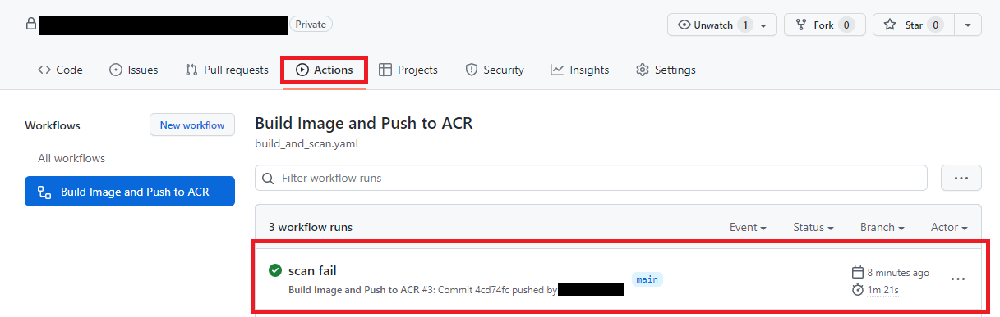 

スキャン結果を確認します。Defender for Cloud の `推奨事項` から、`脆弱性を修復する` -> `コンテナー レジストリ イメージでは脆弱性の検出結果が解決されている必要がある` をクリックします。Defender for Cloud にコンテナー イメージの情報が反映されるまで時間がかかる場合があります。表示されない場合は数分待ってから再度確認してください。

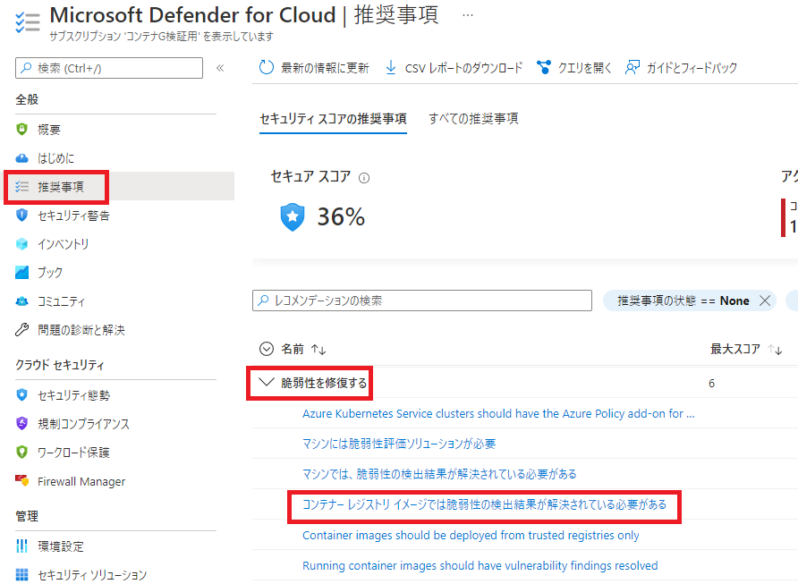  

`コンテナー レジストリ イメージでは脆弱性の検出結果が解決されている必要がある` 画面の `影響を受けるリソース` 配下 `異常なレジストリ` 欄にレビュー用 ACR の名前が表示されていることが確認できます。（下図では `chapter04acrreview` として表示されています）  
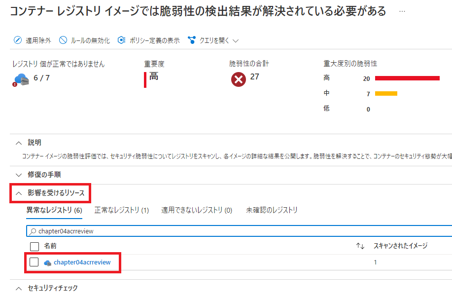  

ACR の名前をクリックすると、ACR 内のイメージごとの脆弱性の検知結果が確認できます。  
下図のとおり作成したコンテナー イメージに混入させた CVE-2021-44832 が検知されています。該当の脆弱性をクリックすると、その脆弱性に関する詳細な説明と修復方法を確認できます。  
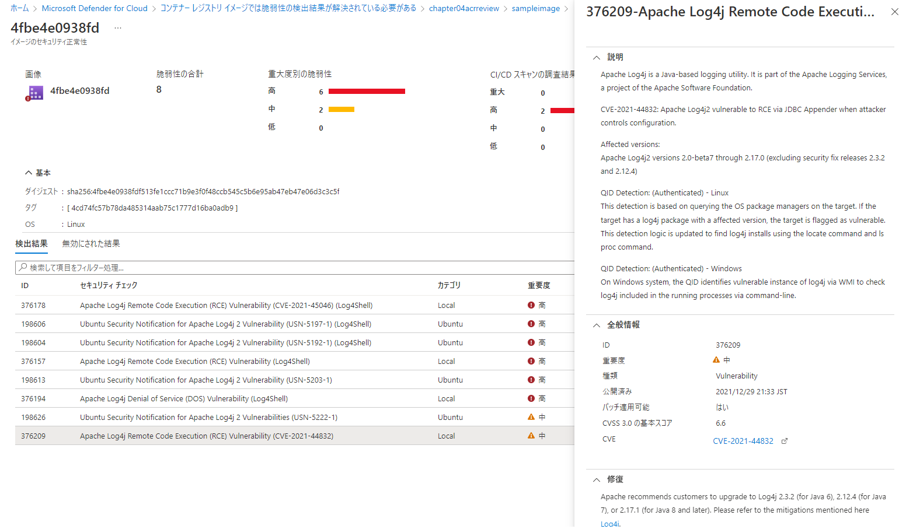  

CVE-2021-44832 の修復方法として、Log4j のバージョンアップが推奨されています。Dockerfile を以下のように修正し、再度 GitHub に Push します。

```Dockerfile
FROM ubuntu:20.04

RUN apt-get update && apt-get -y upgrade

# <修正箇所> 脆弱性が修正されたパッケージをインストール
RUN apt-get install -y liblog4j2-java=2.17.1-0.20.04.1

RUN apt-get clean && rm -rf /var/lib/apt/lists

RUN groupadd -r wpuser && useradd -r -g wpuser wpuser
USER wpuser

CMD ["/bin/bash"]
```

```bash
$ git add -A
$ git commit -m 'scan pass'
$ git push
```

再度 `コンテナー レジストリ イメージでは脆弱性の検出結果が解決されている必要がある` 画面を確認すると、`正常なレジストリ` 配下に本番用 ACR が表示されています。（下図では `chapter04acrpro` として表示されています）  

  

イメージの詳細からも脆弱性が検知されなかったことが確認できます。

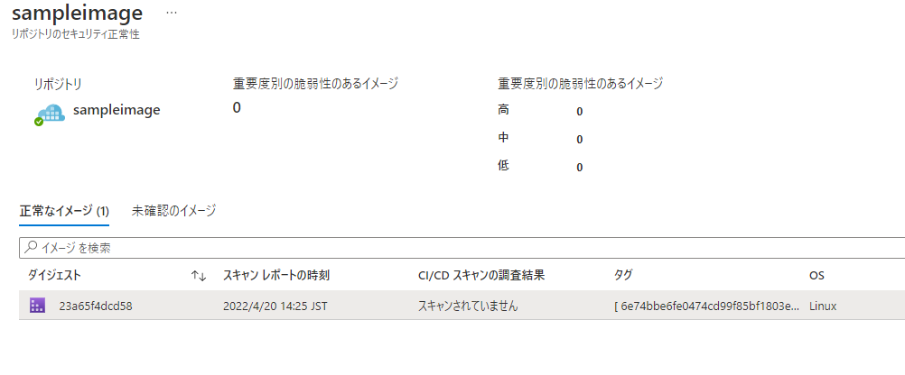  

以上で パイプライン内でイメージスキャンを行い、脆弱性が検知されなかったものだけを本番用 ACR に格納する流れが確認できました。  
本チュートリアルではポータルからスキャン結果を確認しました。脆弱性検知時の通知が必要な場合は、GitHub Actions 内に通知アクションを組み込む、[Defender for Cloud と Logic Apps の連携機能を利用する](https://docs.microsoft.com/ja-jp/azure/defender-for-cloud/workflow-automation) などの手段を組み合わせて使用します。


### 4.4. Azure Policyによる防御
前節ではコンテナー イメージをビルドする際の脆弱性スキャンを確認しました。本節では **Azure Policy** による脆弱な設定の抑止を確認します。  
前述の参照アーキテクチャーの以下箇所が対象です。  
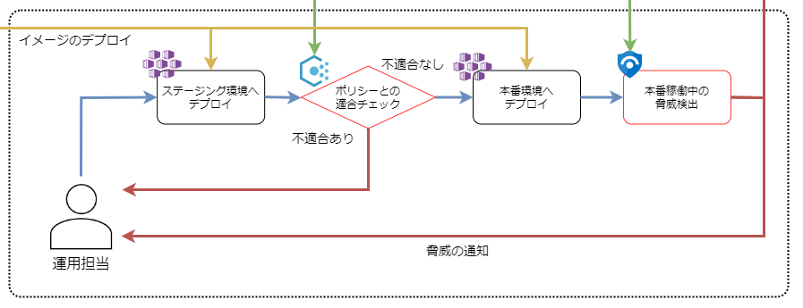  


### 4.4.1. AKS デプロイ用パイプライン
前節に続き本節でも GitHub Actions を利用します。以下の 2 つのパイプラインを作成します。

- staging ブランチへの Push をトリガーに、ステージング AKS に Pod をデプロイする
- main ブランチへのマージをトリガーに、本番用 AKS に Pod をデプロイする


[GitHub](https://github.co.jp/) 上で新規リポジトリを作成し、リポジトリをローカル環境にクローンします。クローン後、初期ブランチとして main ブランチを作成します。  

```bash
$ git clone git@github.com:<アカウント名>/<リポジトリ名>.git

# main ブランチの作成
$ cd <リポジトリ名>
$ git commit --allow-empty -m "initial commit"
$ git branch -m main

# GitHub へ Push
$ git push --set-upstream origin main
```

ローカル環境で `staging` ブランチを作成し切り替えます。

```bash
$ git checkout -b staging
```

ローカル環境上にワークフロー ファイルを配置します。ワークフロー ファイルは本リポジトリの [codes/chapter04/github_workflow](codes/chapter04/github_workflow) 配下の [deploy-aks-staging.yaml](codes/chapter04/github_workflow/deploy-aks-staging.yaml) と [deploy-aks-production.yaml](codes/chapter04/github_workflow/deploy-aks-production.yaml) の 2 つを使用します。  
以下のディレクトリ構造を作成し、ファイルを配置してください。  

```
.
└── .github
    └── workflows
       ├── deploy-aks-production.yaml
       └── deploy-aks-staging.yaml
```

GitHub Actions が AKS にデプロイできるようにするため、サービスプリンシパルを作成します。下記コマンド内の `${subscriptionId}` と `${rgName}` をそれぞれ Azure サブスクリプション ID 、リソースグループ名 に置き換えて実行してください。

```bash
$ az ad sp create-for-rbac --name "GitHub_Actions_Contributor" --role contributor --scopes /subscriptions/${subscriptionId}/resourceGroups/${rgName}
```

コマンド出力結果の json は後の工程で使用します。

```json
{
  "appId": "########-####-####-####-############",
  "displayName": "GitHub_Actions_Contributor",
  "password": "*************************",
  "tenant": "########-####-####-####-############"
}
```
[4.3.1.](#431-github-actions-による-パイプラインの構築) と同様に、GitHub Actions で AKS へのデプロイを行うために [Open ID Connect](https://docs.microsoft.com/ja-jp/azure/developer/github/connect-from-azure?tabs=azure-portal%2Clinux#use-the-azure-login-action-with-openid-connect) を利用します。  
ブラウザで Azure ポータルを開き、 `Azure Active Direcroty` -> `アプリの登録` とクリックします。
`所有しているアプリケーション` 欄から先ほど作成した **GitHub_Actions_Contributor** を探し、名前をクリックします。  

`GitHub_Actions_Contributor` のページにて、`証明書とシークレット` -> `フェデレーション資格情報` と遷移し、 `資格情報の追加` をクリックします。
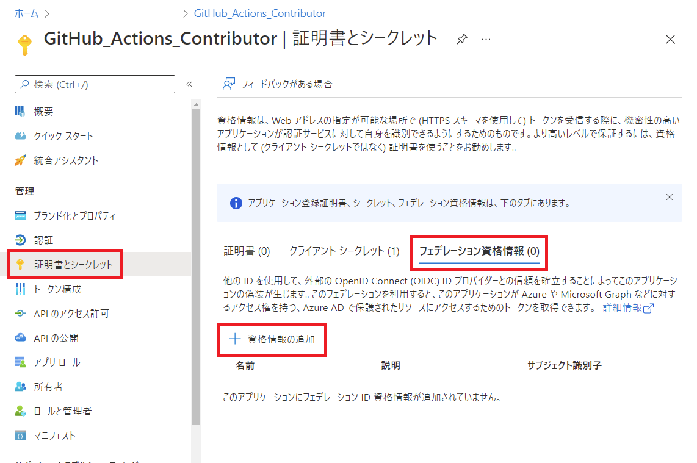

以下の項目を入力します。ブランチごとに資格情報が必要となるため、main ブランチ用と staging ブランチ用の計 2 つの資格情報を追加します。

| 項目 | main 用入力値 | staging 用入力値| 
| - | - | - |
| フェデレーション資格情報のシナリオ |Azure リソースをデプロイする GitHub Actions | Azure リソースをデプロイする GitHub Actions |
| 組織 | GitHub のユーザー名 | GitHub のユーザー名 |
| リポジトリ名 | GitHub のリポジトリ名 | GitHub のリポジトリ名 |
| エンティティ型 | ブランチ | ブランチ |
| GitHub ブランチ名 | main | staging |
| 名前 | GitHub_Actions_Contributor_main | GitHub_Actions_Contributor_staging |

入力が完了したら `保存` をクリックします。main 用と staging 用でそれぞれ以下のような登録内容となります。  
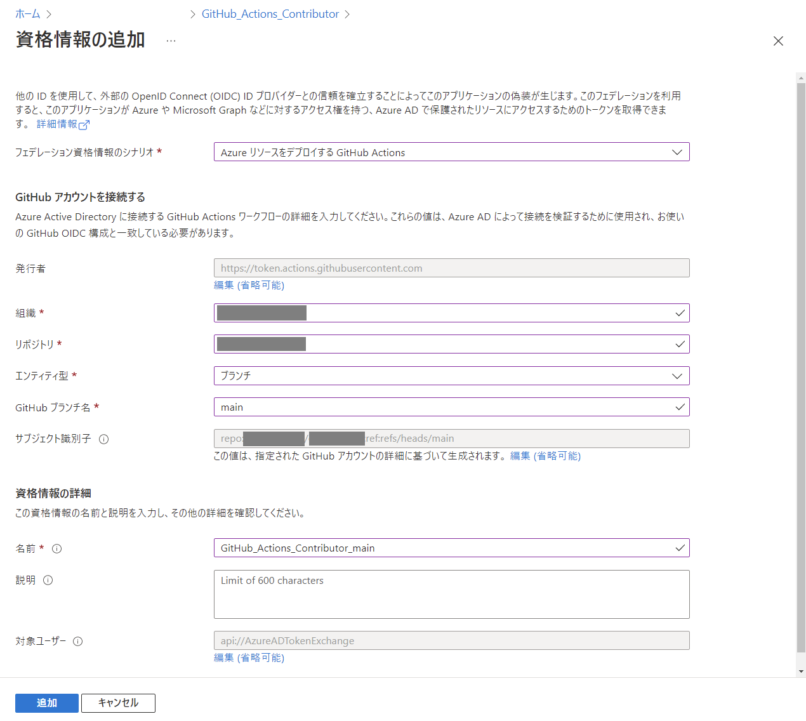  

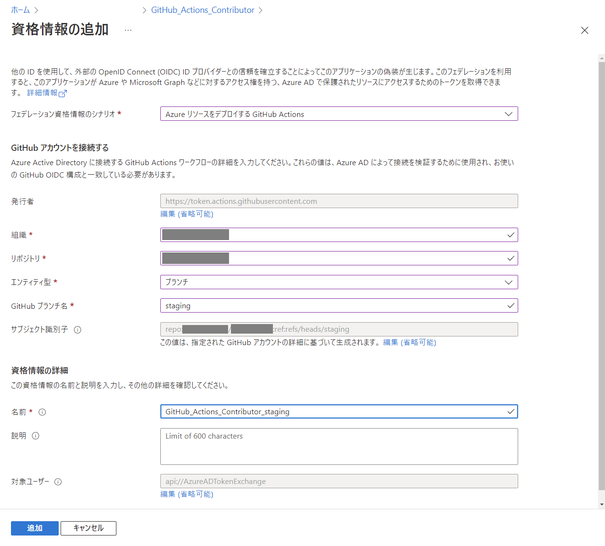  


続いて、GitHub Actions の Secrets を定義します。作成した GitHub リポジトリにて `Settings` -> `Secrets` -> `Actions` とクリックし、設定画面を開きます。  


画面上の `New Repository secret` をクリックし、以下 6 個の Secret を定義します。  

| Name | Value |
| - | - |
| CLUSTER_NAME_PRODUCTION | 本番用 AKS 名 |
| CLUSTER_NAME_STAGING | ステージング用 AKS 名 |
| CLUSTER_RESOURCE_GROUP | リソースグループ名 |
| AZURE_CLIENT_ID | サービスプリンシパル作成時の出力結果 `appId` の値 |
| AZURE_SUBSCRIPTION_ID | Azure サブスクリプションの ID |
| AZURE_TENANT_ID | サービスプリンシパル作成時の出力結果 `tenant` の値|


AKS 名、リソースグループ名、サブスクリプション ID は以下のコマンドを実行することで確認できます。

```
# 本番用 AKS 名
$ az deployment sub show -n main --query properties.outputs.aksNamePro.value -o tsv
# ステージング用 AKS 名
$ az deployment sub show -n main --query properties.outputs.aksNameStg.value -o tsv
# リソースグループ名
$ az deployment sub show -n main --query properties.outputs.rgName.value -o tsv
# Azure サブスクリプションの ID
$ az deployment sub show -n main --query properties.outputs.sucscriptionID.value -o tsv
```

### 4.4.2. Azure Policyによる防御のデモ

続いて Azure Policy による、脆弱な設定でのデプロイの防止をテストします。  
Portal 画面のすべてのリソースより `リソースグループ` を選択して、Bicep で構築したリソースグループを選択します。
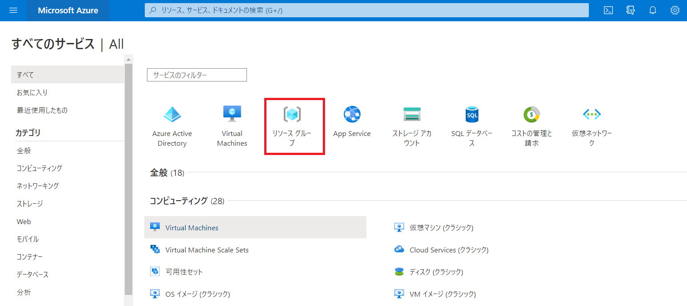  


リソースグループの画面左側のメニューの一覧より `ポリシー` をクリックしてください。 
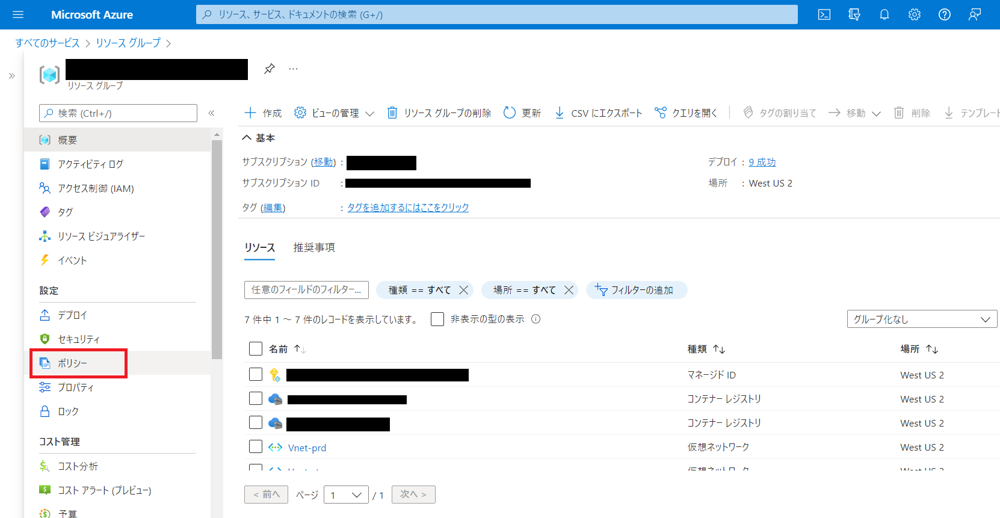

現在の適用されているポリシーの一覧が表示されます。  
一例として、本チュートリアルでは特権を持つコンテナーを AKS 上で稼働させないために新しいポリシーを追加します。  

`ポリシーの割り当て` をクリックしてください。  
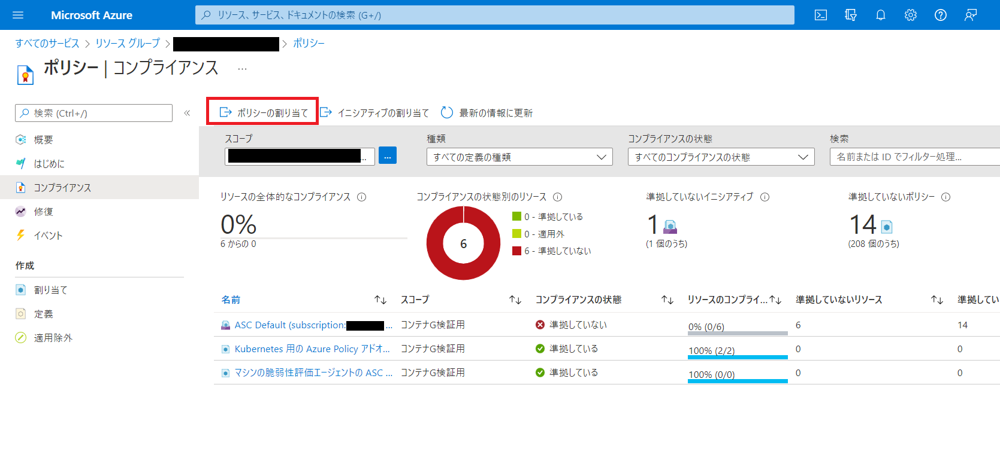 


ポリシーを定義して、新たなポリシーをリソースグループへ割り当てます。  
`基本` -> `ポリシー定義` の右側のボタンをクリックしてください。  
画面右側に `使用可能な定義` の一覧が表示されます。  
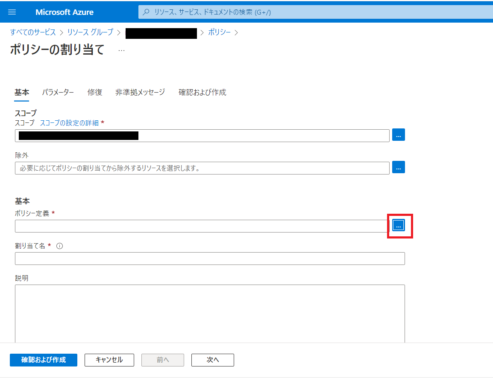 

まずは、利用するポリシー定義のみを表示します。  
検索ボックスに `特権コンテナ` と入力してください。  
一覧に表示された、`Kubernetes クラスターで特権コンテナーを許可しない` を選択して、`選択` ボタンをクリックしてください。  
 

`Kubernetes クラスターで特権コンテナーを許可しない` がポリシー定義で割り当てられていることを確認しください。  
確認後は、`確認及び作成` ボタンをクリックして、続いて表示された `作成` ボタンをクリックください。  
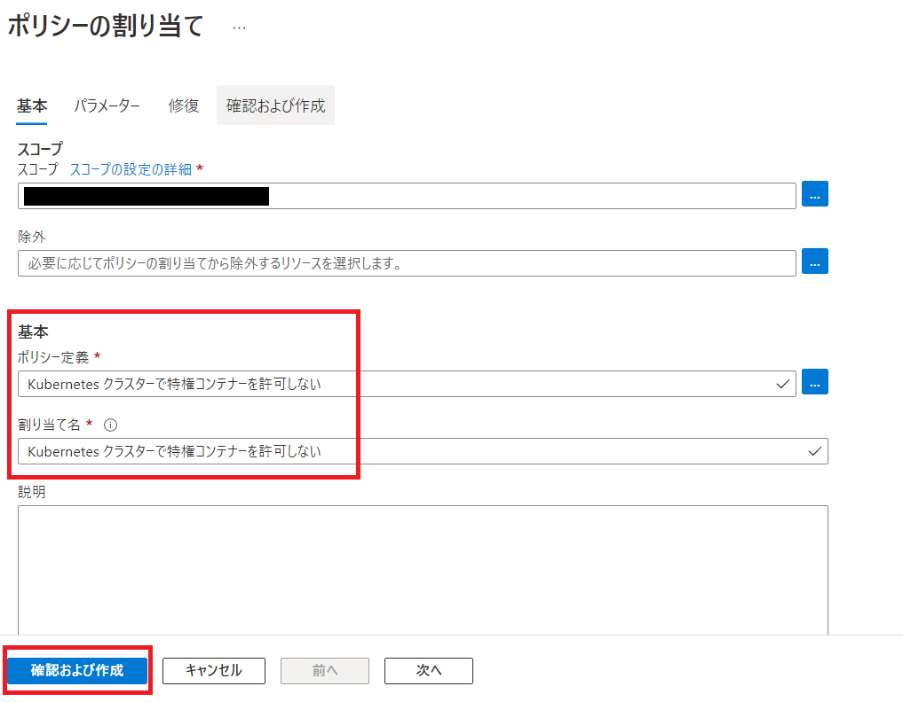 

ポリシーの一覧の画面に戻ります。  
一覧より `Kubernetes クラスターで特権コンテナーを許可しない` のポリシーが作成されていることを確認してください。  
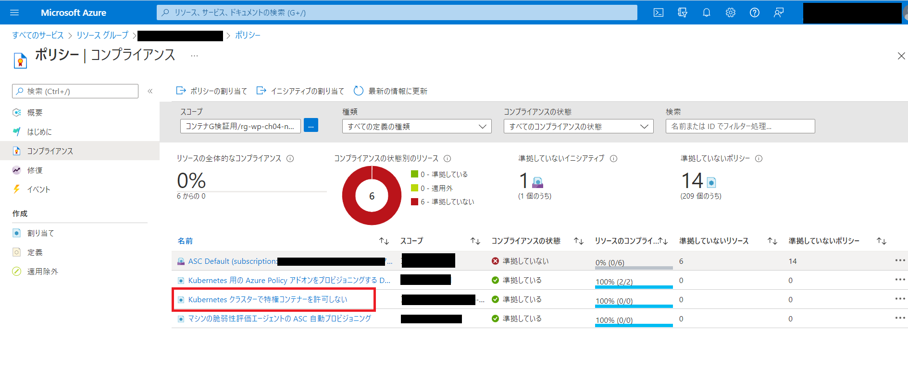 


ポリシーの準備が整ったので、ポリシーが正しく機能することを確認します。

[4.3.](#43-defender-for-containers-によるイメージ-スキャン) で本番用 ACR に格納したイメージをデプロイに利用します。  
ポータルから 本番用 ACR を参照し、コンテナー イメージ名を確認します。下図赤枠部の `docker pull ` を除いた文字列がコンテナー イメージ名です。

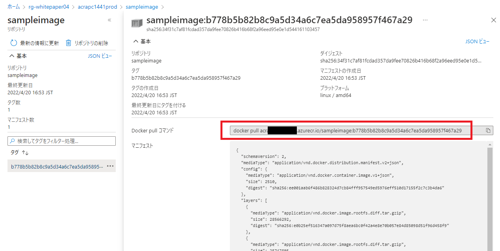 

[4.4.1. AKS デプロイ用パイプライン](#441-aks-デプロイ用パイプライン) で作成したリポジトリに、以下のマニフェストを `sampleapp.yaml` という名前で配置します。  
`${コンテナー イメージ名}` の箇所は確認したイメージ名に置き換えてください。

```yaml
apiVersion: apps/v1
kind: Deployment
metadata:
  name: sampleapp
spec:
  replicas: 1
  selector:
    matchLabels:
      app: sampleapp
  template:
    metadata:
      labels:
        app: sampleapp
    spec:
      containers:
      - name: app-privileged
        image: ${コンテナー イメージ名}
        command: ['sleep', '3600']
        securityContext:
          privileged: true        
```

ファイルを準備したら、以下コマンドで staging ブランチとして Push します。

```bash
$ git add -A
$ git commit -m 'privileged container'
$ git push --set-upstream origin staging
```

Push をトリガーに GitHub Actions のジョブが起動し、ステージング AKS に対するデプロイが始まります。  
しばらくすると、GitHub Actions のジョブが失敗したことが確認できます。  

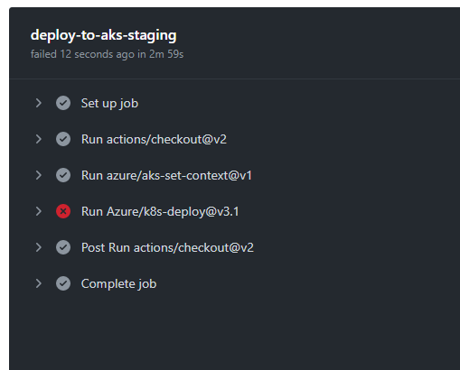 


デプロイ エラーとなった原因は以下のコマンドで確認できます。

```bash
# ステージング用 AKS クラスターの認証情報を取得
$ az aks get-credentials -g ${rgName} -n ${STAGING_AKS_NAME}
# AKS クラスターのイベントを表示
$ kubectl get events
```

以下、出力結果を抜粋したものです。

```
3m48s       Warning   FailedCreate        replicaset/sampleapp-77cf64b64b   Error creating: admission webhook "validation.gatekeeper.sh" denied the request: [azurepolicy-container-no-privilege-a1cf00a4c5acc8466962] Privileged container is not allowed: app-privileged, securityContext: {"privileged": true}...
3m28s       Warning   FailedCreate        replicaset/sampleapp-77cf64b64b   Error creating: admission webhook "validation.gatekeeper.sh" denied the request: [azurepolicy-container-no-privilege-890a68f8e60da006d603] Privileged container is not allowed: app-privileged, securityContext: {"privileged": true}...
39s         Warning   FailedCreate        replicaset/sampleapp-77cf64b64b   Error creating: admission webhook "validation.gatekeeper.sh" denied the request: [azurepolicy-container-no-privilege-a1cf00a4c5acc8466962] Privileged container is not allowed: app-privileged, securityContext: {"privileged": true}...
111s        Warning   FailedCreate        replicaset/sampleapp-77cf64b64b   Error creating: admission webhook "validation.gatekeeper.sh" denied the request: [azurepolicy-container-no-privilege-890a68f8e60da006d603] Privileged container is not allowed: app-privileged, securityContext: {"privileged": true}...
```

ポリシーで設定した特権コンテナーの実行防止が正常に機能し、GateKeeper によって起動が抑止されていることが確認できます。  

Azure Policy が機能していることが確認できたので、次にマニフェストを修正し正常にデプロイできることを確認します。

以下のようにマニフェストを修正し、再度 GitHub の staging ブランチに Push します。

```yaml
apiVersion: apps/v1
kind: Deployment
metadata:
  name: sampleapp
spec:
  replicas: 1
  selector:
    matchLabels:
      app: sampleapp
  template:
    metadata:
      labels:
        app: sampleapp
    spec:
      containers:
      - name: app
        image: ${コンテナー イメージ名}
        command: ['sleep', '3600']
        # <修正箇所> 特権コンテナーの実行許可を削除
        #securityContext:
          #privileged: true       
```

```bash
$ git commit -m 'no privileged'
$ git push
```

GitHub Actions が稼働し、ステージング AKS クラスターに Pod がデプロイされたことが確認できます。

```bash
$ kubectl get pod
NAME                         READY   STATUS    RESTARTS   AGE
sampleapp-57495ff7d5-wm4jh   1/1     Running   0          117s

```

ステージング環境での Pod の正常起動が確認できたら、GitHub 上で Pull Request を作成し、`staging` ブランチを `main` ブランチへマージします。  

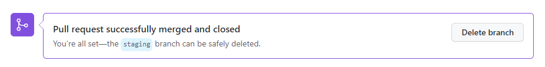  

`main` ブランチへのマージをトリガーとして、本番用 AKS へのデプロイ ジョブが起動し、本番 AKS クラスター上で Pod が起動します。  

```bash
# 本番用 AKS クラスターの認証情報を取得
$ az aks get-credentials -g ${rgName} -n ${PRODUCTION_AKS_NAME}
# AKS クラスターの Pod を表示
$ kubectl get pod
NAME                         READY   STATUS    RESTARTS   AGE
sampleapp-57495ff7d5-48lg2   1/1     Running   0          2m3s
```

### 4.5. 環境のクリーンアップ

以下の手順を実行し、デプロイした Azure リソースを削除してください。  

```shell
# リソースグループを削除
$ az group delete --name $rgName
```

作成したサービス プリンシパルを確認します。  

```shell
$ az ad sp list --show-mine --query "[].{Name:appDisplayName,objectId:objectId}" -o table
Name                        objectId
--------------------------  ------------------------------------
GitHub_Actions_AcrPush      @@@@@@@@-@@@@-@@@@-@@@@-@@@@@@@@@@@@
GitHub_Actions_Contributor  @@@@@@@@-@@@@-@@@@-@@@@-@@@@@@@@@@@@
```

本チュートリアルでは `GitHub_Actions_AcrPush` と `GitHub_Actions_Contributor` の 2 つのサービス プリンシパルを作成しました。  
以下のコマンドでサービス プリンシパルを削除します。  

```bash
$ az ad sp delete --id ${objectId}
```

Microsoft Defender for Conteiners を無効にする場合は、`設定|Defender プラン` の画面から変更します。  
画面右部を下へスクロールすると、`Defender プラン` の一覧が表示されます。  
プラン一覧より `コンテナー` および `コンテナー レジストリ` のスライドボタンを `オン` から `オフ` に変更してください。  
変更後は、`保存` ボタンをクリックしてください。  

  

以上で環境のクリーンアップは終了です。  


## コラム: Dependabot
**Dependabot** は GitHub で利用可能なセキュリティ対策サービスです。プロジェクト内の依存関係をチェックし、セキュリティアップデートが必要なパッケージを更新する Pull Request を自動的に発行します。  
本章で紹介した Defender for Containers と合わせて利用することで、脆弱性のチェックをより厳格に行うことができます。Dependabot の詳細な情報は以下のサイトを参照ください。  
[Keeping your supply chain secure with Dependabot](https://docs.github.com/en/code-security/dependabot)  

## コラム: Microsoft SentinelによるMITRE View
Microsoft Sentinel には、蓄積したデータを基に脅威を検出しその種類をマッピングし表示する機能があります。本ドキュメント執筆時点の 2022 年 4 月現在ではプレビューの段階ですが、 [はじめに](chapter00.md) の文章でも触れている MITRE ATT&CK のマトリクス形式で可視化できます。  
  
既に準備されている分析ルールで自動的に脅威の種類を分類するほか、MITRE のどのカテゴリに分類するかをカスタム ルールを定義することで独自に設定可能です。  
  


一定のデータ量を蓄積する必要があるため本章のチュートリアルでは解説を省略しましたが、実際に運用する中で効果を発揮するサービスです。
