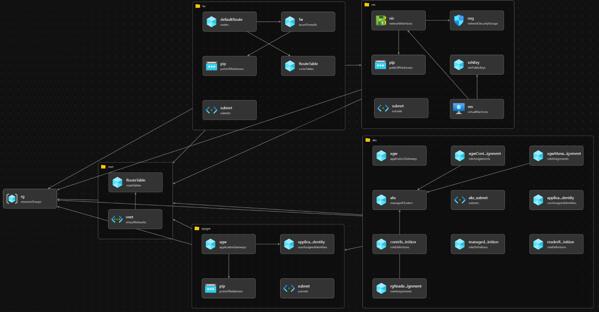
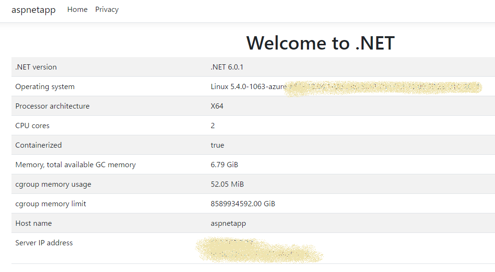

# 第1章 AKSネットワーキングとセキュリティ - 参照アーキテクチャ

高セキュリティ構成の AKS クラスターの参照アーキテクチャです。[Bicep](https://docs.microsoft.com/ja-jp/azure/azure-resource-manager/bicep/overview#:~:text=Bicep%20%E3%81%AF%E3%80%81%E5%AE%A3%E8%A8%80%E5%9E%8B%E3%81%AE,%E3%82%B5%E3%83%9D%E3%83%BC%E3%83%88%E3%81%8C%E6%8F%90%E4%BE%9B%E3%81%95%E3%82%8C%E3%81%BE%E3%81%99%E3%80%82&text=%E3%83%87%E3%83%97%E3%83%AD%E3%82%A4%E4%B8%AD%E3%80%81Bicep%20CLI%20%E3%81%AB%E3%82%88%E3%82%8A,JSON%20%E3%81%AB%E5%A4%89%E6%8F%9B%E3%81%95%E3%82%8C%E3%81%BE%E3%81%99%E3%80%82) で実装しています。    
構成の詳細については **第 1 章 AKS ネットワーキングとセキュリティ** を参照下さい。

# 構成



- Azure Resource Group
- Azure Virtual Network
  - Subnets
  - Route Table
- Azure Firewall
  - Public IP
- Azure Application Gateway
  - Public IP
  - User Assigned Identities
- Azure Kubernetes Service
  - Private Cluster Settings
  - AGIC Settings
    - roleAssignments
- Azure Virtual Machine
  - ssh Public Key

# 操作方法

## 前提条件

参照アーキテクチャをデプロイするには以下の準備が必要です。あらかじめご確認ください。  
  
(1) [Azure CLI](https://docs.microsoft.com/ja-jp/cli/azure/install-azure-cli) または [Azure Cloud Shell](https://docs.microsoft.com/ja-jp/azure/cloud-shell/overview) が利用可能であること  
  
(2) `~/.ssh` 配下に `id_rsa` という名称の RSA 暗号鍵のキーペアが作成済であること  
    ※ 未作成の場合、以下のコマンドでキーペアを作成してください  
      `ssh-keygen -f  ~/.ssh/id_rsa -N ""`

## 参照アーキテクチャーのデプロイ

以下の手順を実行し、参照アーキテクチャのデプロイを実行してください。

```shell
# パラメータとして任意の公開鍵のファイルの中身を渡し、デプロイを実行してください
# 任意： AppName をオプションとして与えると、AppName の値が各種リソース名に反映されます
$ az deployment sub create -f main.bicep --location japaneast -p sshPublicKey="$(cat ~/.ssh/id_rsa.pub)" [-p AppName=$ApplicationName]
```

## 踏み台サーバーへのログイン

以下の手順を実行し、以降の手順に必要な CLI コマンドを取得してください。

```shell
$ az deployment sub show -n main --query properties.outputs
{
  "aksGetCredentialsCommand": {
    "type": "String",
    "value": "az aks get-credentials -g $resourcegroupname -n $clustername"
  },
  "sshCommand": {
    "type": "String",
    "value": "ssh -p $sshPort azureuser@$FirewallPublicIP"
  }
}
```

コマンドの実行結果内の `sshCommand` -> `value` に記載されている CLI コマンドを実行し、踏み台サーバーに接続してください。

```shell
$ ssh -p 10022 azureuser@$FirewallPublicIP
```

### 踏み台サーバーから AKS を操作

以下の手順を実行し、Application Gateway Ingress コントローラー(AGIC) のサンプルアプリケーションをデプロイしてください。

```shell
# Azure アカウントへのログイン
$ az login                   # ブラウザでデバイスログインを実行
$ az account list -o table
$ az account set -s $subscriptionId

# Kubernetes CLI インストール
$ sudo az aks install-cli

# AKS のクレデンシャルの取得
$ az aks get-credentials -g $resourcegroupname -n $clustername

# AGIC のサンプルアプリケーションをデプロイ
$ kubectl apply -f https://raw.githubusercontent.com/Azure/application-gateway-kubernetes-ingress/master/docs/examples/aspnetapp.yaml

# AGIC の状態確認
$ kubectl get ingress
NAME        CLASS    HOSTS   ADDRESS        PORTS   AGE
aspnetapp   <none>   *       $globalIP      80      10s
```

ブラウザ等でグローバル IP アドレス(Application Gateway のパブリック IP アドレス) へアクセスし、サンプルアプリケーションの Web GUI 画面が閲覧できることを確認してください。



## リソースのクリーンアップ

以下の手順を実行し、デプロイした Azure リソースを削除してください。

```shell
# リソースグループを削除
$ az group delete --name $resourcegroupname
```
