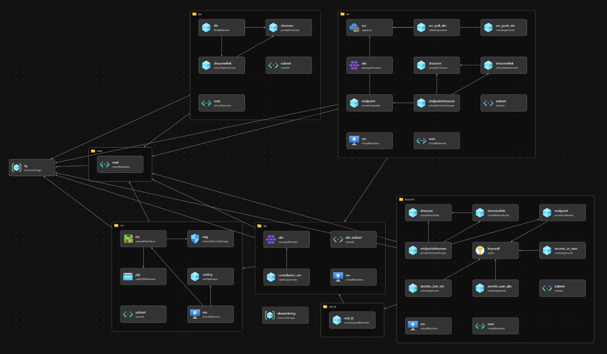

# 第3章 秘匿情報の管理
AKS から Key Vault を利用する構成の参照アーキテクチャです。[Bicep](https://docs.microsoft.com/ja-jp/azure/azure-resource-manager/bicep/overview?tabs=bicep) で実装しています。   

# 構成



- Azure Resource Group
- Azure Virtual Network
  - Subnets
- Azure Kubernetes Service
  - Private Cluster Settings
  - Azure Keyvault Secrets Provider
- Azure Virtual Machine
  - ssh Public Key
  - Public IP
  - System Assigned Identities
- Azure Database for PostgreSQL - Flexible Server
  - Private DNS Zone
- Azure Container Registry
  - Private DNS Zone
  - Private Endpoint
- Azure Key Vault
  - Private DNS Zone
  - Private Endpoint


# 操作方法

## 前提条件

参照アーキテクチャをデプロイするには以下の準備が必要です。あらかじめご確認ください。  
  
(1) [Azure CLI](https://docs.microsoft.com/ja-jp/cli/azure/install-azure-cli) または [Azure Cloud Shell](https://docs.microsoft.com/ja-jp/azure/cloud-shell/overview) が利用可能であること。  
  
(2) `~/.ssh` 配下に `id_rsa` という名称の RSA 暗号鍵のキーペアが作成済であること。  
    ※ 未作成の場合、以下のコマンドでキーペアを作成してください。  
      `ssh-keygen -f  ~/.ssh/id_rsa -N ""`

(3) ランダムな文字列を 3 ～ 6 文字程度で決定してください。
    ※ 今回作成するリソースの一部にユニークな名前付けをする必要があり、他のユーザーと重複しないようにするために必要です。  

## 参照アーキテクチャーのデプロイ

以下の手順を実行し、参照アーキテクチャのデプロイを実行してください。「$RandomString」は前提条件 (3) で決定したランダムな文字列を指定してください。

```shell
# パラメータとして任意の公開鍵のファイルの中身を渡し、デプロイを実行してください
# 任意： AppName をオプションとして与えると、AppName の値が各種リソース名に反映されます(英数字のみ指定可能)
$ az deployment sub create -f main.bicep --location japaneast \
    -p sshPublicKey="$(cat ~/.ssh/id_rsa.pub)" \
    -p clientIpAddress=$(curl http://whatismyip.akamai.com/) \
    -p userObjectId="$(az ad signed-in-user show --query objectId --output tsv)" \
    -p randomStr=$RandomString [-p AppName=$ApplicationName]
```

## 作業用サーバーへのログイン
以下の手順を実行し、以降の手順に必要な CLI コマンドを取得してください。

```bash
$ az deployment sub show -n main --query properties.outputs
{
  "acrname": {
    "type": "String",
    "value": "$ACRNAME"
  },
  "aksGetCredentialsCommand": {
    "type": "String",
    "value": "az aks get-credentials -g $resourcegroupname -n $clustername"
  },
  "databasename": {
    "type": "String",
    "value": "$DATABASENAME"
  },
  "keyvaultname": {
    "type": "String",
    "value": "$KEYVAULTNAME"
  },
  "managedid": {
    "type": "String",
    "value": "$MANAGEDID"
  },
  "sshCommand": {
    "type": "String",
    "value": "ssh azureuser@$PublicIP"
  },
  "tenantid": {
    "type": "String",
    "value": "$TENANTID"
  }
}
```

コマンドの実行結果内の sshCommand -> value に記載されている CLI コマンドを実行し、踏み台サーバーに接続してください。

```bash
$ ssh azureuser@$PublicIP
```

## 作業用サーバーでの事前準備

```bash
# Azure CLI のインストール
$ curl -sL https://aka.ms/InstallAzureCLIDeb | sudo bash

# Azure アカウントへのログイン
$ az login --identity                   # VM のマネージド ID を使用してログインします
$ az account list -o table              # サブスクリプションの一覧を出力し、作業対象のサブスクリプションに間違いがないことを確認する

# Kubernetes CLI インストール
$ sudo az aks install-cli

# AKS のクレデンシャルの取得
$ az aks get-credentials -g $resourcegroupname -n $clustername
```

## チュートリアル用パラメーターの確認
チュートリアル手順の中で利用するパラメーターを以下のコマンドで確認できます。手順内で置き換えの指示がある箇所は、このコマンドの出力結果を参照してください。  

```bash
$ az deployment sub show -n main --query properties.outputs
{
  "acrname": {
    "type": "String",
    "value": "$ACRNAME"
  },
  "aksGetCredentialsCommand": {
    "type": "String",
    "value": "az aks get-credentials -g $resourcegroupname -n $clustername"
  },
  "databasename": {
    "type": "String",
    "value": "$DATABASENAME"
  },
  "keyvaultname": {
    "type": "String",
    "value": "$KEYVAULTNAME"
  },
  "managedid": {
    "type": "String",
    "value": "$MANAGEDID"
  },
  "sshCommand": {
    "type": "String",
    "value": "ssh azureuser@$PublicIP"
  },
  "tenantid": {
    "type": "String",
    "value": "$TENANTID"
  }
}
```

出力結果の値は以下のとおりです。チュートリアルの中でこれらの値を利用するため、作業中に参照できるように上記の出力結果を保存してください。

| 項目名 | 説明 | 
|-|-|
| acrname | 作成した Azure Container Registry の名前 |
| aksGetCredentialsCommand | Azure Kubernetes Service の資格情報を取得するコマンド |
| databasename | 作成した Azure Database for PostgreSQL の名前 |
| keyvaultname | 作成した Azure Key Vault の名前 |
| managedid | AKS に付与されたマネージド ID。Key Vault への認証に利用する。 |
| sshCommand | 作業用 VM にログインするための SSH コマンド |
| tenantid | Azure のテナント ID |

## 参照アーキテクチャー 構成補足
実行する Bicep のコード内で、各リソースに以下のロールを割り当てています。

| 割り当て対象 | スコープ | ロール |
|-|-|-|
| VM のマネージド ID | AKS | 共同作成者 |
| VM のマネージド ID | ACR | ACRPush |
| VM のマネージド ID | Key Vault | キー コンテナー シークレット責任者 |
| AKS のマネージド ID | ACR | ACRPull |
| AKS のマネージド ID | Key Vault | キー コンテナー シークレット ユーザー | 
| デプロイを実行したユーザー ID | Key Vault | キー コンテナー シークレット責任者 |

また、デプロイを実行したユーザーのパブリック IP アドレスを Key Vault のファイアウォール設定に登録し、ポータルからの操作を可能にしています。