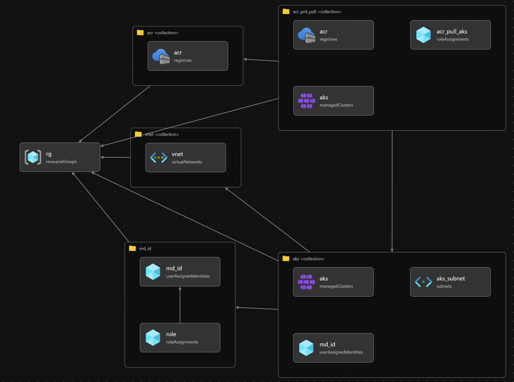

# 第4章 セキュアなCI/CDパイプラインの構築 - 参照アーキテクチャ


# 構成



- Azure Resource Group
- Azure Virtual Network
  - Subnets
- Azure Kubernetes Service
  - User Assigned Identities
- Azure Container Registry

# 操作方法

## 前提条件

参照アーキテクチャをデプロイするには以下の準備が必要です。あらかじめご確認ください。  
  
(1) [Azure CLI](https://docs.microsoft.com/ja-jp/cli/azure/install-azure-cli) または [Azure Cloud Shell](https://docs.microsoft.com/ja-jp/azure/cloud-shell/overview) が利用可能であること  
  
(2) ランダムな文字列を 3 ～ 6 文字程度で決定してください。
    ※ 今回作成するリソースの一部にユニークな名前付けをする必要があり、他のユーザーと重複しないようにするために必要です。  

## 参照アーキテクチャーのデプロイ

以下の手順を実行し、参照アーキテクチャのデプロイを実行してください。「$RandomString」は前提条件 (2) で決定したランダムな文字列を指定してください。

```shell
# パラメータとして任意の公開鍵のファイルの中身を渡し、デプロイを実行してください
# 任意： AppName をオプションとして与えると、AppName の値が各種リソース名に反映されます
$ az deployment sub create -f main.bicep --location japaneast -p randomStr=$RandomString [-p AppName=$ApplicationName]
```

## チュートリアル用パラメーターの確認
チュートリアル手順の中で利用するパラメーターを以下のコマンドで確認できます。  

```bash
$ az deployment sub show -n main --query properties.outputs
{
  "acrNamePro": {
    "type": "String",
    "value": "${ACRNAME}prod"
  },
  "acrNameReview": {
    "type": "String",
    "value": "${ACRNAME}review"
  },
  "aksNamePro": {
    "type": "String",
    "value": "${clustername}-prd"
  },
  "aksNameStg": {
    "type": "String",
    "value": "${clustername}-stg"
  },
  "rgName": {
    "type": "String",
    "value": "rg-whitepaper04"
  },
  "sucscriptionID": {
    "type": "String",
    "value": "########-####-####-####-############"
  }
}
```

出力結果の値は以下のとおりです。チュートリアルの中でこれらの値を利用するため、作業中に参照できるように上記の出力結果を保存してください。

| 項目名 | 説明 | 
|-|-|
| acrNamePro | 本番用 Azure Container Registry の名前 |
| acrNameReview | レビュー用 Azure Container Registry の名前 |
| aksNamePro | 本番用 Azure Kubernetes Service の名前 |
| aksNameStg | ステージング用 Azure Kubernetes Service の名前 |
| rgName | リソース グループ名 |
| sucscriptionID | Azure のサブスクリプション ID |

以下のように環境変数に設定することで、チュートリアル内のコマンドを円滑に実行できます。

```
$ export subscriptionId=$(az deployment sub show -n main --query properties.outputs.sucscriptionID.value -o tsv)
$ export rgName=$(az deployment sub show -n main --query properties.outputs.rgName.value -o tsv)
$ export STAGING_AKS_NAME=$(az deployment sub show -n main --query properties.outputs.aksNameStg.value -o tsv)
$ export PRODUCTION_AKS_NAME=$(az deployment sub show -n main --query properties.outputs.aksNamePro.value -o tsv)
```